# Development diary

## 2026-09-09 — Shift summons the help card; Shift-drag zoom retired

### What changed
The first help card now has to be **asked for**. Holding **Shift** and pointing at anything
carrying `data-help` opens its card in ~90 ms; without the key nothing opens, however long
you dwell. Phases 0 and 1 of `docs/help-hover-trigger-plan.md`, in one branch because phase 0
exists only to free the key.

**Phase 0 — Shift-drag zoom-to-range is gone.** Wheel-to-zoom and drag-to-pan already covered
the job between them, and one modifier meaning two things — a chart gesture in the plot and a
documentation gesture everywhere else — was not survivable once help cards are wanted *inside*
the chart (phase 4 of the plan). What is actually lost is precision in a single gesture:
jumping straight to an exact bar span instead of a few wheel notches and a pan.

- `src/lib/chart/interactions.ts` — `drawZoomSelection` and `ZoomSelection` deleted.
  `barIndexAtX`, `barCenterX` and `isInPlot` stay, and `FanDetail`'s crosshair now calls all
  three instead of re-deriving the same three expressions inline.
- `src/lib/chart/viewport.ts` — `setRange` deleted with its only two callers. `zoomAtBar`,
  `panByBars` and `reset` are a complete viewport API; an uncalled setter is not.
- `src/components/detail/FanDetail.tsx`, `src/components/modals/FanTradeReview.tsx` — the
  `selectionRef`, the `e.shiftKey` branch in `onDown`, `drawSelection` and the selection branch
  in `endPointer`, in both copies. `FanTradeReview`'s overlay canvas went with them: the
  marquee was the only thing ever drawn on it.
- `src/components/ui/ChartControls.tsx` — the hint is now `scroll = zoom · drag = pan`.

**Phase 1 — the trigger is a pure function.** `HOVER_DELAY = 380 ms` was inside the range of
ordinary pointer travel, so a card was as likely to be interrupting a question as answering
one — and it opens 330 px of opaque panel *downward over the content below the anchor*.

- `src/help/trigger.ts` (new) — `decideTrigger(state, delays)`, modelled on `place.ts`
  ("Pure, so it is testable"). Rules in order: a mouse button down opens nothing and arms
  nothing; a term inside a card is never gated (180 ms); help mode, an open chain or a live
  latch mean plain hover (380 ms); the modifier means 90 ms; otherwise closed but *armable*.
  `SUMMON_MODIFIER` is one constant, and `SUMMON_LABEL` is where the on-screen copy comes
  from, so changing the key changes the footer and the `help` card with it.
- **Why Shift and not Ctrl/Cmd**, recorded in the module: Ctrl+click is the secondary click on
  macOS and every help target is a live control; Ctrl/Cmd+wheel is browser zoom; and Ctrl/Cmd+T
  opens a browser tab, which would fight the pin key — silently, since `onKey` already ignores
  `T` with those modifiers. `Shift+T` is unbound, and `onKey` lowercases, so pinning works with
  the key still held and needed no change at all.
- `src/help/HelpProvider.tsx` — the latch. `latchedUntil` is `Infinity` while a card is
  showing and `now + 800 ms` once the last one closes on its own, so you can leave a card, look
  at what it described and hover a neighbour without reaching for Shift again. `Esc`, a click
  outside, a scroll or a resize sets it to `0`: an explicit dismissal means *stop showing me
  cards*. Pinned cards deliberately do not hold it open — a pin is a parked reference, not a
  reading session.
- The pending target is now recorded even when nothing opens, which is the path that matters:
  the pointer is usually already parked on the thing before the hand reaches for the key, so
  the keypress arms what is already pending rather than waiting for another mouse move.
  Releasing the key cancels a card that has not appeared yet and never closes one that has.
- Modifier state is read from `e.shiftKey` on keydown, keyup *and* mouse events rather than by
  matching `e.key` — that gets both Shift keys for free and recovers the state when the key
  went down before the window had focus. `buttons !== 0` on every `mouseover` re-derives
  "pointer busy", so a `mouseup` missed outside the window cannot wedge the layer shut.
- `src/help/trigger.test.ts` (new) — the matrix: cold, latched, expired, nested, help mode, and
  pointer-busy with the modifier held (a Shift-held chart pan must flash nothing).

### How to test
`npm run dev`, then: sweep the pointer across the TopBar, the filter row and the table for ten
seconds — no card. Point at "Backtest" and press Shift — card in about a tenth of a second;
press `T` while still holding Shift and it pins, with no browser side effect. Release Shift,
move into the card, hover a highlighted term — the child card opens as before. Close with `Esc`
and hover a different chip — nothing, because the dismissal cleared the latch; let a card close
by walking away instead and hover a neighbour within ~0.8 s — it opens without Shift. On the
detail chart: scroll zooms, drag pans, and holding Shift through a pan flashes nothing.

## 2026-09-08 — Price-action patterns on the candlestick chart

### What changed
The detail chart can now **draw what the bars are saying**: eleven price-action patterns,
each toggled independently, over the candles. Phase 1 of `docs/price-action-patterns-plan.md`.

- `src/lib/patterns.ts` (new) — the detectors, pure and isomorphic like `indicators.ts`:
  pivots (long and short), the HH/HL/LH/LL sequence, pullbacks, 2- and 3-bar reversals, pin
  bars, engulfing, inside, outside, doji and failed breakouts. `detectPatterns(bars, ids,
  config?)` runs the ones you ask for and returns `PatternMarker[]` sorted by confirming bar.
- **One marker shape for all eleven** — `{ id, index, from, to, dir, price, tag, note }`. The
  drawing layer and the crosshair readout need nothing else, so a twelfth pattern is a
  function plus a registry row and no change to the chart.
- **`from`/`to` are the bars the pattern *is*, not the bars that confirmed it.** A pivot spans
  its own bar and carries `strength`; an inside bar spans the mother bar too. That is what
  makes `markersAtBar` — "which patterns is this bar part of?" — an interval test, and it is
  what stopped the readout from claiming the three bars either side of a swing were pivots.
- **Confirmed only, and detected over the full history.** Nothing appears before the bars
  establishing it have printed, so the last few bars carry no pivot; and because detection is
  not windowed, panning never changes what a pattern is. The chooser can therefore count
  patterns you have not turned on yet.
- Every threshold sits in `PatternConfig` (3/1-bar pivots, 2-bar minimum pullback, 20-bar
  breakout level, a quarter-ATR noise floor for the single-bar shapes), so phase 2 can tighten
  one without forking a detector.
- `src/lib/chart/patternLayer.ts` (new) — the glyph vocabulary: triangles at pivots (big for
  3-bar, a dot for 1-bar), HH/HL/LH/LL chips on a dashed zigzag, a tinted band over a
  pullback, a bracket around the bars of a formation, the broken level as a dashed line for a
  failed breakout. **Chips are collected during drawing and laid out last**, best-ranked
  first (structure, then turns, then shapes), each pushed a row at a time until it lands on
  free pixels and *dropped* rather than overprinted when there are none — the glyph still
  marks the bar. Below 5 px per bar the text goes entirely and only glyphs remain.
- `src/components/ui/ChartControls.tsx` — a "Patterns · n ▾" chooser beside MACD / Stoch RSI,
  grouped, each row carrying the count in the visible window. `patterns` is an **optional**
  prop, so `FanTradeReview` compiles unchanged and can opt in later.
- `src/components/detail/FanDetail.tsx` — wiring, plus the crosshair readout now lists every
  pattern covering the hovered bar (four, then a count).
- `src/help/` — a `pattern` help kind and twelve cards. The ids are `pa-`-prefixed on purpose:
  the chart's two-bar reversal is a **stricter, different rule** from the builder's
  `reversal-2bar` step, and the cards say so and link to each other rather than pretending
  one definition serves both. Same for `pa-pullback` vs `step-pullback`.

### Why this shape
These are readings, not signals — who is in control, where a stop logically sits, whether a
move is continuation or turn. That is why they live beside `indicators.ts` rather than in
`lib/strategy/`, whose definitions are tuned for firing entries and are deliberately
different.

### How to test
- `npm test` — `src/lib/patterns.test.ts` (36 cases: each detector plus its near-miss — the
  second bar that barely recovers, the long wick with a fat body, the break that holds, the
  tie that is nobody's pivot — the confirmation edges, and the combined result's ordering)
- `src/help/glossary.test.ts` now asserts a card exists behind every registry entry
- `npm run dev` → click a row → **Patterns**. Pivots and HH/HL/LH/LL are on by default; zoom
  in past ~5 px per bar for the labels; hover a bar for the patterns it belongs to.

## 2026-09-08 — Screener parity phase 4: saved screens

### What changed
A screen can now be **named, saved, reloaded and made the one that opens at start-up**.
Phase 4 — the last — of `docs/screener-parity-plan.md`.

- `src/lib/screen/storage.ts` (new) — `SavedScreen` = `{ id, name, savedAt, filters, sort,
  columns, view, signalStrategy, default? }` under `stockScreener.screens.v1`, same
  injected-storage + re-parse-on-load pattern as `strategy/storage.ts`. **One storage object,
  two key spaces**: `store.ts` passes the same injected storage to the strategies loader and
  to the slice.
- **A stale screen is repaired, not dropped.** The parse drops what no longer means anything
  clause by clause — a field that left the registry or stopped being filterable, a second
  clause on the same field, a slope lookback the chip cannot show — then `sanitizeColumns`
  drops unknown/filter-only column ids and puts the pinned ones back, and `sanitizeSort`
  falls back to the view's default for a sort key that no longer resolves. Only a screen with
  no id or no name is thrown away.
- `src/lib/screen/columns.ts` — gains those two sanitizers plus `EXTRA_SORT_KEYS`, the
  entries table's own sort keys (`barsAgo`, `entryPrice`, …), so "does this key still
  resolve?" can be answered without reaching into a component. `DEFAULT_SORT` **moved here
  from `store/screenSlice.ts`** (which re-exports it) — it is a per-view default like
  `DEFAULT_COLUMNS`, and `sanitizeSort` needs it below the store.
- `src/store/screenSlice.ts` — `screens` / `activeScreenId` plus `screenState`,
  `screenDirty`, `newScreen`, `saveScreen`, `saveScreenAs`, `loadScreen`, `renameScreen`,
  `deleteScreen`, `setDefaultScreen`, `applyDefaultScreen`. `store.ts` gained no state: one
  extra argument to `createScreenSlice` and one line in `init` (after the strategies load, so
  a saved entry strategy resolves).
- **Load order is the whole trick.** `loadScreen` sets the filters first (so the scan the
  strategy setter starts already carries the saved floors, and there is exactly one scan),
  then the strategy through `setSignalStrategy` — which moves the tab — and only then the
  saved tab. A screen whose strategy has since been deleted loads with no strategy rather
  than a scan that can only fail.
- **`screenDirty` is a comparison, not `clausesActive`.** It diffs the live state against the
  saved copy field by field (clause order included, key order not), so `Save` appears only
  for a real change. Nothing loaded is never dirty — a draft is not a modified copy.
- `src/components/filters/ScreenMenu.tsx` (new) — the screen name, a ▾ (New / Save /
  Save as… / Rename… / Delete, then the saved list with a ★ for the start-up screen) and a
  `Save` button that appears only when dirty. It **replaces the filter bar's explanatory
  sentence** in the right-hand corner, as the plan called for; that sentence's content lives
  in the `filters`, `filter-chip` and `market-cap` help cards.
- Help: new `saved-screen` card on the name button — the last id the plan owed.

The search box is deliberately **not** part of a screen: it is a lookup, not a filter worth
naming. `filteredMatches` / `filteredNear` are still unused by the UI — phase 2 flagged the
duplication, phase 3 kept the component's `useMemo` for the unfiltered totals, and phase 4
did not need to disturb it either. That is now three phases of "later"; it belongs to
whatever next touches `ScreenView.tsx`.

### How to test
- `npm run test` — new `lib/screen/storage.test.ts` (round-trip, corrupt JSON, an entry with
  no identity, stale clauses/columns/sort keys, one default only, and what `screenStateEqual`
  does and does not notice); `lib/screen/fields.test.ts` covers the two sanitizers;
  `store.test.ts` covers save/dirty/load/delete/rename, the default screen at start-up, the
  saved floors on the first scan, and a strategy that no longer exists
- `npm run dev` — add a chip, sort a column, Save as… a name: the corner shows it with no
  dot. Edit the chip and `Save` lights up; save, mark it ★, reload — the chips, sort, columns
  and tab come back. Verified end to end, including a screen saved on the Entries tab, which
  reloads with its strategy selected and the tab live.

---

## 2026-09-08 — Screener parity phase 3: view tabs and the docked chart

### What changed
The side-by-side split and the modal chart drawer are gone. The screener is now **one
full-width table under three view tabs**, with the candlestick chart **docked beside the
list** instead of covering it. Phase 3 of `docs/screener-parity-plan.md`.

- `src/components/ScreenView.tsx` (was `FanLists.tsx`) — one component, one `ScreenTable`.
  Tabs are **EMA fan · Close to fan · Entries**, each with its filtered count; Entries is
  dead (and shows `—`) until an entry strategy is chosen. All three row sets are filtered on
  every render, so switching tab is a repaint, never a re-screen. The card header keeps the
  count sentence, the list's own rule and the ⚙; the "n of m shown" line now counts the
  search box as filtering too, which the fan lists previously ignored.
- **Two axes, deliberately not merged.** `ScreenView` (`'fan' | 'entries'`) stays the *table
  shape* — the column set and sort, which `near` shares with `fan`. The new `ScreenTab`
  (`'fan' | 'near' | 'entries'`) in `lib/screen/columns.ts` is the *row set*, i.e. the
  visible tab, and `tableViewOf(tab)` maps one to the other. Phase 4's `SavedScreen.view` is
  a `ScreenTab`.
- `src/components/detail/DetailPanels.tsx` — `DetailOverlay` became **`DetailDock`**: a
  resizable flex sibling of the table (no backdrop), so the list stays visible and clicking
  another row swaps the symbol in place. Drag the left edge to resize; the chart's existing
  `ResizeObserver` redraws it, and pointer moves are coalesced to one width per frame. Esc
  or ✕ closes — unless a help card is up, which owns Escape first.
- `src/lib/screen/dock.ts` (new) — `clampDockWidth` / `isNarrow` and the three constants.
  The dock is at least 420 px and never squeezes the table below 520 px, so a width dragged
  on a wide screen still fits a narrow one; **below 1100 px the panel falls back to the old
  full-height overlay** with its click-outside backdrop. Kept pure so the drag handler, the
  store and the tests share one rule.
- `src/store/screenSlice.ts` — gains `view` and `dockWidth` (plus `setView` / `setDockWidth`).
  `store.ts` gained no new state: its `setSignalStrategy` now moves the tab, since picking a
  strategy should show its entries and clearing it should not leave an empty tab selected.
  A tab that outlives what enabled it (a deleted strategy, a saved screen in phase 4) is
  corrected at render — the visible tab is derived, not trusted.
- Help: new `detail-dock` card on the drag handle; the tabs carry the existing `fan`,
  `fan-near` and `live-entry` ids that used to sit on the two panel titles.

**The plan's "rows per screen roughly doubles" expectation was wrong, and this is the place
to say so.** The old split was two *side-by-side* panels, so each already ran the full height
of the window: 27 rows at 34 px in a 1216 px-tall viewport, before and after. What the
full-width table actually buys is width — the whole 15-column set is visible at once instead
of scrolling sideways inside a half-width panel — and one list at a time with its own tab
rather than two lists competing for the same glance. Vertical density is now a row-height
question, not a layout one.

### How to test
- `npm run test` — new `lib/screen/dock.test.ts` (clamping, the list minimum, a NaN width,
  the breakpoint boundary); `lib/screen/fields.test.ts` covers `tableViewOf`; `store.test.ts`
  covers the default tab, the strategy select moving it, and the dock-width clamp
- `npm run dev` — click a row: the chart docks right and the table stays scrollable; click
  another row and the symbol swaps in place; drag the divider and the chart redraws; switch
  tabs and the fan/near lists share their columns and sort while Entries brings its own;
  pick a strategy and the tab follows, clear it and it goes back
- Under 1100 px wide the panel goes back to covering the list — verify by narrowing the
  window (temporarily raising `DOCK_BREAKPOINT` is the quick way on a large display)

---

## 2026-09-08 — Screener parity phase 2: filter clauses and chips

### What changed
The six fixed dropdowns are gone. Filters are now an **open list of clauses**, one per field,
rendered as TradingView-style chips with free numeric ranges and a `+` that adds any
filterable field in the registry. Phase 2 of `docs/screener-parity-plan.md`.

- `src/lib/screen/filters.ts` (replaces `src/lib/filters.ts`) — the `Clause` model:
  `range` (either bound optional) on any numeric field, `in` for the sector, `bars` for the
  200-EMA slope. `applyClauses` / `filterRows` evaluate it, `clausesActive` tells the "n of m
  shown" line whether to speak, and `signalFloorsOf` projects the three floors the `/signals`
  scan still takes server-side. `DEFAULT_FILTERS` is the 1-month slope test alone, so the
  out-of-the-box behaviour is unchanged.
- **Units follow the field's `kind`, in one place.** A `ratio` field holds a fraction and its
  chip is typed in percent — volatility `3` is stored as `0.03`; a `percent` field is already
  in percent units, so `changePct` `2.5` stays `2.5`. `parseCompact` (new, in
  `screen/format.ts` beside its inverse `fmtCompact`) reads `400K` / `1.2B`.
- **A range clause drops rows whose value is missing**, whichever bound is set — NaN in
  process, `null` after JSON, identically. A freshly listed name has no RSI to compare, and
  silently keeping it would be the wrong answer. Sorting keeps the opposite convention on
  purpose: missing sinks to the bottom but stays in the list. The `filter-chip` help card
  says so, because a count that shrinks for an invisible reason is the confusing case.
- `src/store/screenSlice.ts` (new) — `search`, `filters`, `columns`, `sort` and
  `filteredMatches` / `filteredNear` moved out of `store.ts`, which keeps only the data and
  async layer plus the slice import. The slice compares `signalFloorsOf` before and after
  every filter change and re-runs the entries scan **only when a floor actually moved**, so a
  sector or RSI chip is applied client-side with no round trip — the old hand-maintained
  `scanKeys` list is gone.
- `src/components/filters/` — `FilterChip.tsx` (the chip plus its editor: two bounds, quick
  values, a sector checklist, the three slope lookbacks), `FieldPicker.tsx` (the `+`, with a
  type-ahead) and `useDismiss.ts`. `FilterBar.tsx` keeps the entry-strategy select and
  becomes the chip row. The old dropdown presets survive as one-click quick values; the
  backtest modal still uses the preset arrays as selects.
- Sector choices come from the loaded dataset: `fields.ts` gained `setSectorOptions`, wired
  once to the store's facts, so `FieldDef.options` is no longer a declared-but-unimplemented
  hole.
- Help: new `filter-chip` card; the `filters` card now explains which three chips the entries
  scan is given up front and why. Existing `data-help` ids (`min-price`, `avg-volume`,
  `market-cap`, `sector`, `ema200-slope`) ride on the chips that replaced their dropdowns.

The layout is still the two-panel split and the modal chart — that is phase 3.

### How to test
- `npm run test` — new `lib/screen/filters.test.ts` (every clause kind, open-ended ranges,
  both percent conventions, `300M` / `1.2B` parsing, `signalFloorsOf`, and that the default
  set reproduces the old dropdown behaviour); `src/store.test.ts` asserts the `/signals` body
  carries floors derived from clauses and that a client-side clause does not re-scan
- `npm run dev` — add Price 20–100, RSI 14 40–50 and Avg vol ≥ 400K as chips and watch the
  count go "3 of 14 shown"; pick an entry strategy, change the slope chip (one `/signals`
  request) then add a sector chip (none)
- `curl -s -X POST http://localhost:8787/signals -H 'content-type: application/json'
  -d '{"strategy":"tag50","minAvgVol":400000,"minMarketCap":0,"ema200RisingBars":21}'`

---

## 2026-09-08 — Screener parity phase 1: columns and sorting

### What changed
The screener tables stop being two hand-written CSS grids with a frozen column set. One
`ScreenTable` now renders both the fan lists and the entries list, driven by a **field
registry**, and every row carries an **indicator snapshot** so RSI, Stoch RSI, volatility
and performance are screenable instead of chart-only. Phase 1 of
`docs/screener-parity-plan.md`.

- `src/lib/screen/snapshot.ts` — `IndicatorSnapshot` (volume, RSI 14, Stoch %K/%D, 1M/3M
  performance, ATR%, 52-week high/low) built from the closes, volumes and highs/lows the
  subject already holds. `FanRow` and `FanSignalRow` both gain `snapshot`, so `/screen` and
  `/signals` carry it with no extra round trip. **NaN means "not computable"** — never a
  placeholder 50 — so short histories sort last instead of looking neutral. Stoch RSI stays
  missing until its whole 14-bar RSI window is real (2 × the period), which is where the old
  `?? 50` fallback used to fabricate a zero.
- `src/lib/screen/fields.ts` — one declaration per field drives the header label, width,
  alignment, cell format, sort value and help topic. Units live in the field's `kind`:
  `percent` is already in percent units (`changePct`), `ratio` is a fraction rendered as a
  percent (`worstGap`, perf, ATR%), `compact` is 1.2M / 3.4B. Adding a column is adding a row
  to the list; `GRID` / `SIG_GRID` are gone and the grid template is computed from the
  visible columns.
- `src/lib/screen/sort.ts` — `sortRows` over an injected accessor, so the entries list's own
  columns (entry, stop, R, target window, age) sort through the same code as the fields.
  Missing values sink to the bottom in **both** directions; ties break on the ticker.
- `src/components/table/ScreenTable.tsx` + `ColumnChooser.tsx` — 34 px rows (was 44), a
  sticky header that sorts on click, an `extra` block for the signal-only columns placed
  after `Chg`, and a ⚙ checklist per list. Wider column sets scroll sideways inside the
  panel. Column and sort state live in `store.ts` per view (`fan`, `entries`); the defaults
  and the toggle are pure functions in `lib/screen/columns.ts`.
- `atr14` moved from `strategy/primitives.ts` to `indicators.ts` (re-exported, so the engine's
  imports are unchanged) — the snapshot needed it without importing the strategy layer.
  `fmtCompact` moved to `lib/screen/format.ts`, likewise re-exported from `lib/filters.ts`.
- New help cards: `rsi`, `stoch-rsi`, `volume`, `rel-vol`, `perf`, `atr-pct`, `week52`,
  `column-chooser`. The `Stoch RSI` alias moved from the backtest panel's card to the
  indicator's, where it belongs.
- Removed the unused `@tanstack/react-table` dependency.

The filter bar, the six dropdowns and the two-panel layout are untouched — those are phases
2 and 3.

### How to test
- `npm run test` — new `lib/screen/{snapshot,sort,fields}.test.ts`, snapshot assertions in
  `server/screen.test.ts` and `lib/fanSignals.test.ts`, sort/column state in `src/store.test.ts`
- `npm run dev` — sort the fan list by Rel vol, then by RSI; the arrow shows on both panels
  (they share the fan view's sort); hide the EMA columns from the ⚙ and Gap / RSI / Stoch
  come into view; the header stays pinned while the list scrolls
- `curl -s -X POST http://localhost:8787/screen -H 'content-type: application/json' -d '{}'`
  — every row carries `snapshot`

---

## 2026-09-07 — Strategy builder replaces the fixed fan strategies

### What changed
A strategy is no longer one of eight hardcoded ids with its own detector in `fanBacktest.ts`. It is a
**`StrategyDef`**: an ordered state machine of parameterized steps plus three editable trade rows
(entry / stop / exit). The eight former strategies are built-in presets made of steps, and one engine
serves the backtest, the live signal scan and the schematic example. This entry closes the four-phase
plan in `docs/strategy-builder-plan.md`.

- `src/lib/strategy/` — `types.ts` (the model), `primitives.ts` (predicates moved verbatim out of
  `fanBacktest.ts`), `steps.ts` (the step-type registry: kind, holdability, defaults, a param schema
  that drives *both* the parser's coercion and the builder's controls, and `compile`), `engine.ts`
  (walks the steps bar by bar and records one mark per step), `trade.ts` (the R simulator, driven by
  an `ExitSpec`), `presets.ts`, `parse.ts` (shared by server and localStorage), `example.ts`
  (synthesises a sketch and runs the **real** engine over it) and `storage.ts`.
- The backtest modal's strategy `<select>` is now `StrategyBuilder.tsx`: preset / saved picker with
  Save · Save as · Reset · Delete, step cards (type, generated params, hold, max wait, reorder,
  remove), an add-step menu, and the Entry / Stop / Exit rows — the Target, Max hold, breakeven and
  MACD controls moved in from the modal. Custom strategies are saved in localStorage under
  `stockScreener.strategies.v1` and are listed next to the presets in the filter bar; the signal scan
  sends a preset as its id and a saved strategy as its definition.
- Steps are typed by **kind**, which is what makes the machine composable: `candle` consumes a bar,
  `instant` fires on the same bar as the step before it, `guard` must hold on the bar the previous
  step fired, `tracker` fires once and then follows the swing high. A step marked *hold* is an
  invariant — when it breaks, the machine resets to step 1.
- Parity is exact: the new engine reproduces the old one's 14,899 entries across all eight presets —
  same entry bar, price, stop, exit bar and exit reason.

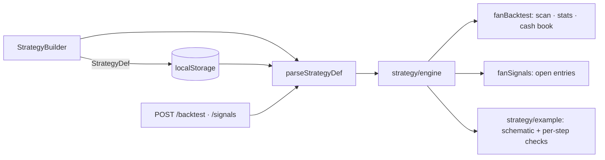

### How to test
- `npm run typecheck`, `npm run test`, `npm run lint`
- `npm run dev`, then **Backtest**: every preset draws an example with one mark per step and a ✓ list;
  pick *New strategy…*, edit the steps, watch the schematic redraw, **Save**, reload — it is still in
  the picker and in the filter bar's *Entry strategy* list; selecting it there scans the universe with
  its definition; **Delete** falls back to the fan lists. Editing a preset marks it *edited* and can
  only be kept via **Save as**. Add a step that cannot fire (e.g. *high below the 200-EMA* after a
  50-EMA tag) and the right pane names the step that never completed.
- ```bash
  curl -s localhost:8787/backtest -H 'content-type: application/json' -d '{"strategy":"tag50","horizons":[5]}' | tail -1 | head -c 200
  curl -s localhost:8787/backtest -H 'content-type: application/json' -d '{"strategy":{"steps":[]}}'   # 400 JSON
  ```

---

## 2026-09-04 — Retire the rule engine and the DAG layer

### What changed
The product has run on the EMA-fan pipeline (`fan.ts`, `fanBacktest.ts`, `fanSignals.ts`) since the 2026-08-24 pivot. The general rule engine in `market.ts` (`evalRule*`, `PRESETS`, `parsePCF`, `evalPatternAt`, `rankPassSet`, `backtestRules`) and the computation-DAG layer under `src/lib/dag/` had no consumer outside their own tests, so both are removed. STORY-045 (DAG compatibility surface) and STORY-047 (DAG schedule surface) are closed as superseded by ADR-008's pivot; neither had a product on the other side.

- `src/lib/indicators.ts` now holds the indicator math (`ema`, `sma`, `rsi`, `stochRsi`, `macd`), moved verbatim.
- `src/lib/market.ts` shrinks to the `Stock` model, `InstrumentBars`, `HorizonStat`, and `buildStock`/`buildUniverse`. The legacy per-bar `Snapshot`, the `snapAt`/`snapAbs`/`ensureEma` hooks, the lazy caches and the index signature on `Stock` are gone with the engine that read them.
- `tests/engine.golden.test.ts` keeps the fixture and indicator pins; the rule, PCF and backtest sections and their snapshot entries are dropped. `src/lib/fidelity.test.ts` (the old-vs-DAG differential) is deleted with the DAG.

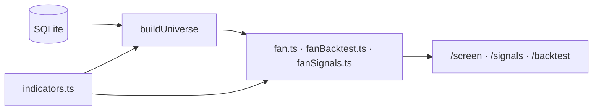

### How to test
- `npm run typecheck`, `npm run test`, `npm run lint`
- `npm run dev` — the two lists, detail chart, signal scan and backtest behave as before.

---

## 2026-08-26 — Shift-drag zoom range on candlestick charts

### What changed
Hold **Shift** and drag on the chart to marquee-select a bar range; on release the viewport zooms to that inclusive candle range (start bar → end bar). Blue dashed overlay while dragging. Works on `FanDetail` and `FanTradeReview`. Control strip hint updated.

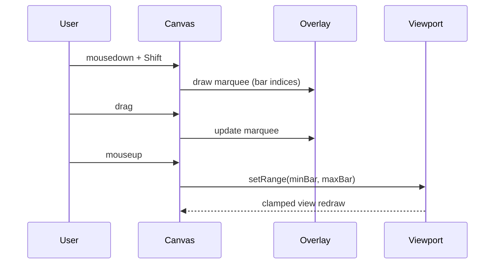

### How to test
- `npm run test` and `npm run lint`
- UI: open a stock detail or trade review chart, hold Shift, drag across several candles, release — chart zooms to that span. Plain drag still pans; scroll still zooms.

---

## 2026-08-26 — Zoom/pan + toggleable MACD & Stoch RSI on candlestick charts

### What changed
Both candlestick charts — the main **detail** chart (`FanDetail`) and the backtest **trade review** (`FanTradeReview`) — now share zoom/pan and toggleable indicator panes.

- **Zoom / pan**: mouse-wheel zooms toward the cursor, click-drag pans, plus a control strip with −/+ zoom and **Reset view** (enabled only when zoomed/panned off the default window). Min window is 8 bars. Price/volume auto-fit to the visible bars.
- **Indicators**: **MACD 12/26/9** and **Stoch RSI 14/3/3** panes, each toggled on/off (default on). `FanTradeReview` previously drew both always-on; `FanDetail` had neither.
- Extracted the shared pieces so both charts behave identically instead of duplicating: a `useChartViewport` hook, `drawMacdPane`/`drawStochPane` renderers, and a `ChartControls` strip. Indicator math is reused from `market.ts` (`macd`, `rsi`, `stochRsi`) — none reinvented.

Out of scope by design: the synthetic `FanExampleChart` schematic and the tiny `Spark`/`EquitySpark` sparklines.

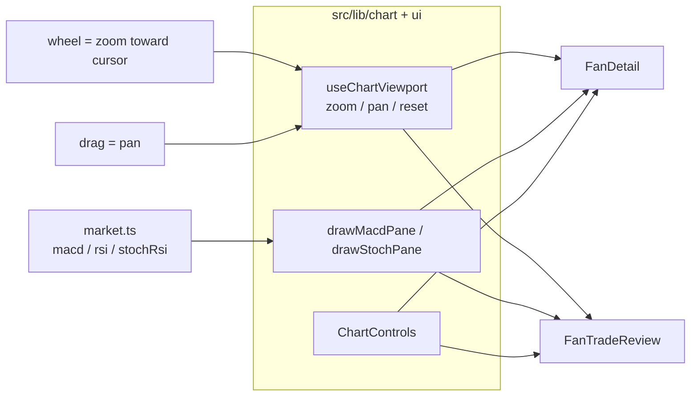

### How to test
- `npm run test` (408 pass) and `npm run lint` (clean)
- UI: `npm run dev` → click a row for the detail chart, or Backtest → run → open a trade. Scroll to zoom, drag to pan, toggle **MACD** / **Stoch RSI**, and use −/+ / **Reset view**. Canvas height reflows as panes toggle.

---

## 2026-08-26 — Live "current entry" screen (strategy filter)

### What changed
The main screener can now filter to **names with a live open entry** for a chosen strategy, with the trade numbers a trader acts on: **entry**, **stop loss**, **R (risk)**, and the **2.5–3R exit window** (as prices). Pick a strategy in the new **Entry strategy** dropdown in the filter bar → the two fan lists are replaced by an **Entries** table; "Fan lists (no entry)" returns to the classifier view.

- A live entry reuses the backtest detector (`findFanEntries`) under a fixed, un-managed 3R config, then keeps the one entry whose simulated trade is still **open on the latest bar** (`exitReason === 'end_of_data'`) — i.e. price is still between the initial 1R stop and target.
- Volume / cap / 200-EMA-slope filters feed the server scan; sector / min-price / search are applied client-side (no re-scan). New endpoint `POST /signals`.

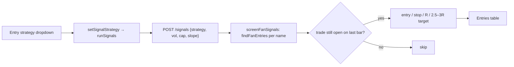

### How to test
- `npm test` — `src/lib/fanSignals.test.ts` (open-entry selection, R + target-window math, filters) and `src/store.test.ts` (scan on strategy pick, re-scan on vol/cap/slope only, error state)
- `npm run dev` → filter bar → **Entry strategy** → pick e.g. Fan onset; rows show Entry / Stop / R / Target window; click a row for the chart
- `curl -s -X POST http://localhost:8787/signals -H 'content-type: application/json' -d '{"strategy":"onset"}'`

---

## 2026-08-26 — Backtest textbook example pane

### What changed
The fan backtest modal now has a **schematic candlestick pane** to the right of the config. It redraws with the selected strategy, target, MACD window, continuation, and max-hold — colored phase bands, EMA 18/50/100/200, and entry/stop/target (or trail) levels. Not a live ticker; EMA spacing is exaggerated on purpose.

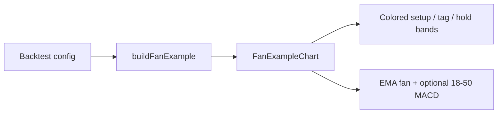

### How to test
- `npm test` — `src/lib/fanExample.test.ts`
- UI: Backtest → change Strategy / Target / MACD / continuation; the right pane should retitle and re-color

---


## 2026-08-25 — Trail confirmed pivot lows

### What changed
Backtest Target can trail **2¢ under each newly confirmed long pivot** after entry (`trailPivot`). Only confirms in `(entry, now]` raise the stop; never loosens. MACD and the default max-hold do not cut while the slow fan holds — same as trail-50. Default remains trail 50.

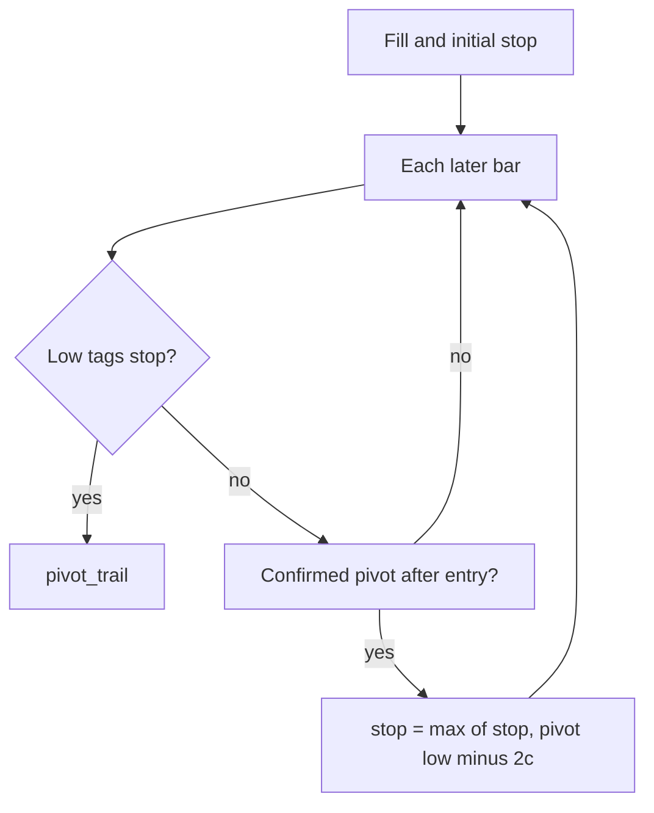

### How to test
- `npm test` — post-entry confirm ratchets then trails out; pre-entry confirm does not; MACD/max-hold skipped; parse `{ trailPivot: true }`
- UI: Backtest → Target → **Trail pivots** (default still Trail 50-EMA)

---

## 2026-08-25 — Bunn continuation entry

### What changed
New backtest strategy `bunn_cont` (not the default). Course Entry #1: 18 adversely crosses 50 while `50>100>200` holds, a Bunn reversal on 100 or 200 during that correction, then a buy stop 2¢ above the bar that **resumes** the full fan. 1R is the bounce low minus 2¢.

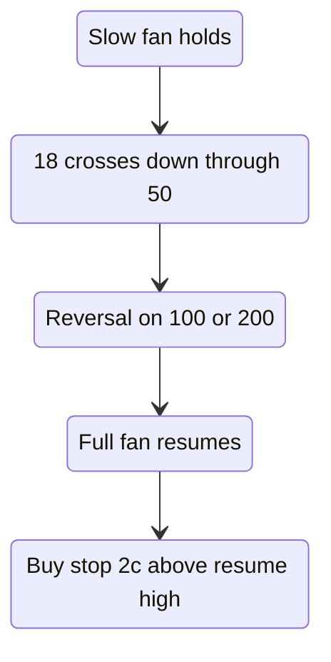

### How to test
- `npm test` — fill ≠ resume close, R from bounce low, no 100/200 bounce → no trade, `tag50` / bounce fixtures unchanged
- UI: Backtest → Strategy → **Bunn continuation** (default remains 50-EMA tag)

---

## 2026-08-25 — Confirmed long pivots

### What changed
Primitive only (no strategy): a long pivot is a 3-bar low (`prev` and `next` lows higher) that is **confirmed** when a later high strictly takes out the high of the bar before the pivot. `lastConfirmedPivotLow` is the most recent such low as of a bar — for continuation stops and pivot-trail later.

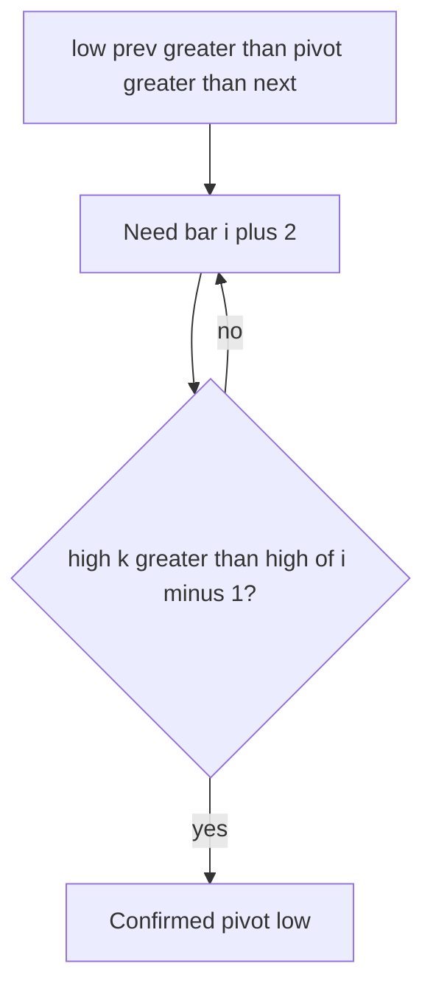

### How to test
- `npm test` — `isLongPivotCandidate`, confirm bar 4 vs equal high 11, `lastConfirmedPivotLow` null until confirm

---

## 2026-08-25 — Bunn 2.5–3R target window

### What changed
Backtest Target can exit at the **2.5R floor** of Bunn’s mechanical window (not trailing, not a 2/3/4R hard multiple). Default remains trail 50.

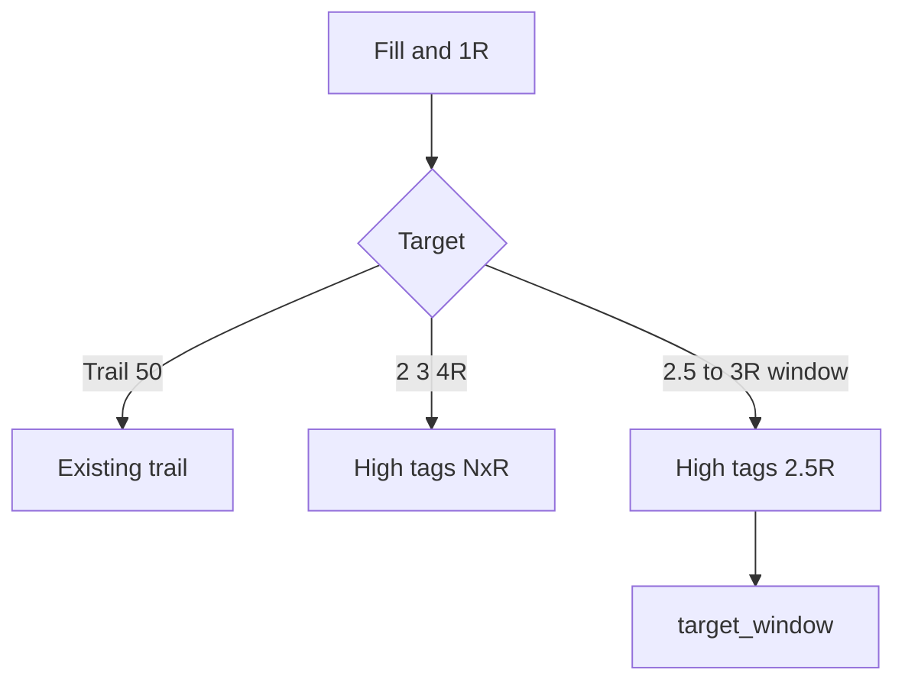

### How to test
- `npm test` — `simulateRTrade` window exit at 2.5R; same-bar stop still wins; parse `{ trailEma: null, targetWindow: true }`
- UI: Backtest → Target → **2.5–3R window** (default still Trail 50-EMA)

---

## 2026-08-25 — Bunn bounce entry (Elite Trend Trader)

### What changed
New backtest strategy `bunn_bounce` (not the default). Encodes Frank Bunn’s fan-bounce entry: a reversal bar on the 50, 100, or 200 while `50 > 100 > 200` holds, filled at a buy stop 2¢ above the trigger, with 1R = trigger-bar height + 2¢. Management is still trail-50 / hard `targetR` so bounce can be compared to `tag50` in R.

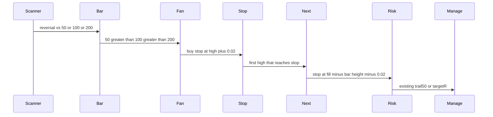

### How to test
- `npm test` — `isBunnLongReversal`, fill ≠ trigger close, R = height + 2¢, 100-EMA bounce without a 50 reversal, `tag50` ALGN fixture unchanged
- UI: Backtest → Strategy → **Bunn bounce** (default remains 50-EMA tag)

---

## 2026-08-25 — Rising 200-EMA lookback filter

### What changed
Lists and backtest can require the **200-day EMA to be higher than it was N trading days ago**. That is the usual “long average has been rising a while” screen (Minervini: at least ~1 month, preferably 4–5).

- Measure: `EMA200[now] > EMA200[now − N]` (not “up every single day”)
- Presets: off / **21** (1 month, default) / 63 (3 months) / 105 (5 months)
- Screener: filter bar, applied after the fan screen. Short history fails the filter.
- Backtest: same check **at the fill bar**, copied from the bar when Backtest opens

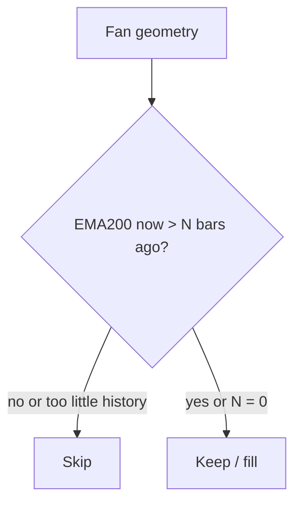

### How to test
- `npm test` — `ema200RisingAt`, list filter, onset skip on short lookback, parse + store copy-on-open
- UI: filter bar **200-EMA slope** defaults to Rising ≥ 1 month; Backtest dropdown matches

---

## 2026-08-24 — Swing-account overlay on the fan backtest

### What changed
The backtester still scores every signal in R (strategy quality). It now also replays those fills as a **cash book**: starting capital, last N months (or until ruin), same entry/exit rules.

- Size = risk % of equity / 1R (initial stop), whole shares, capped by cash
- Max concurrent names (default 4)
- Same-day exits settle before new entries
- Entries are no longer clipped by the 40-bar forward-horizon pad, so a 3-month window actually has fills

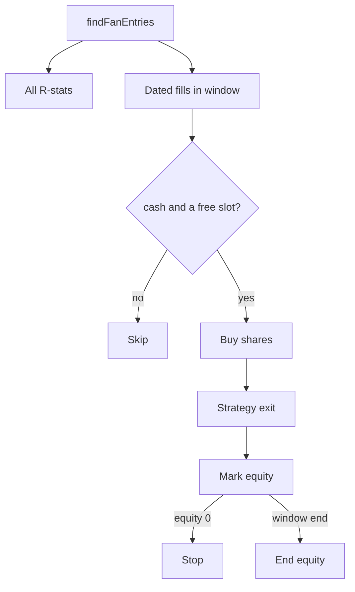

### How to test
- `npm test` — `simulateFanAccount` (1R ≈ 1%, max names, same-day redeploy, window, ruin)
- UI: Backtest → set cash / risk / names / window → Run → Swing account stats + fill table

---

## 2026-08-24 — Backtest MACD / Stoch RSI + vol/cap filters

### What changed
Backtest now snapshots classic **MACD 12/26/9** and **Stoch RSI 14/14/3/3** on each fill (reference only — not an entry gate). Results show win rate / avg R by MACD hist, line vs signal, and Stoch %K zone. The trade chart adds MACD and Stoch panes. Volume and market-cap dropdowns match the main filter bar and are copied from the screener when Backtest opens. Unknown market cap still fails a cap floor, same as the list.

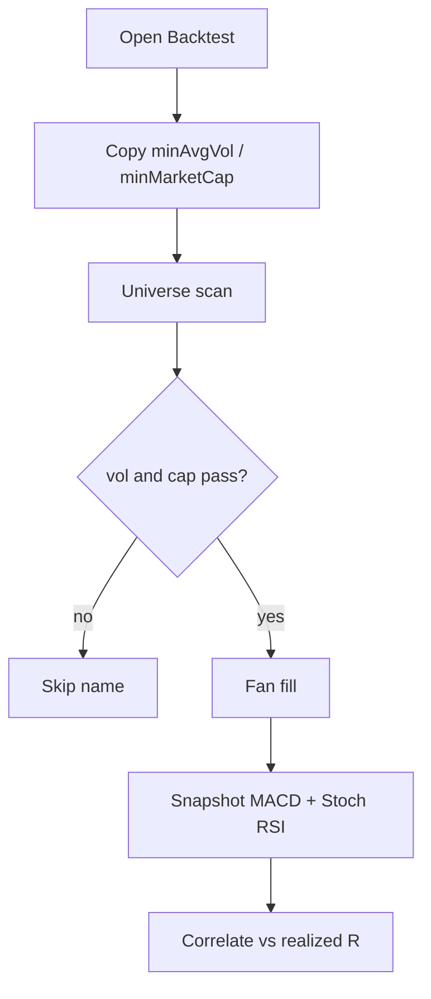

### How to test
- `npm test` — universe skip on vol/cap, MACD snapshot on ramp, factor buckets, parse + store copy-on-open
- UI: set vol/cap on the filter bar → Backtest → dropdowns match → Run → factor table + MACD/Stoch panes on a trade

---

## 2026-08-24 — Setup markers, prev/next, paginated entries

### What changed
Each backtest fill now carries the setup: **fan** (first 18>50>100>200 / 18-50 cross), **high** (swing before the pullback), **tag** (the bounce/fill). The trade chart shades that window, marks those bars, and still shows entry/exit. The entry list is paged (20 rows). The review has Prev / Next across the current result list.

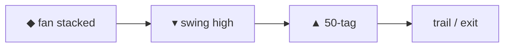

### How to test
- `npm test` — `fanBar` on onset, `tradeChartRange` extra bars, `stepFanTradeReview`
- UI: Backtest → run → page the table → open a row → Prev/Next. Chart should show a purple **fan** diamond before the green **tag**

---
## 2026-08-24 — Full fan at entry + four EMAs on the trade chart

### What changed
Tag/structure entries now require the uptrend fan from the image (`EMA18 > EMA50 > EMA100 > EMA200`) on the entry bar. The episode dies if that stack breaks. The trade chart draws all four EMAs and shows 80 bars before the fill (was 18/50 only, 30-bar pad).

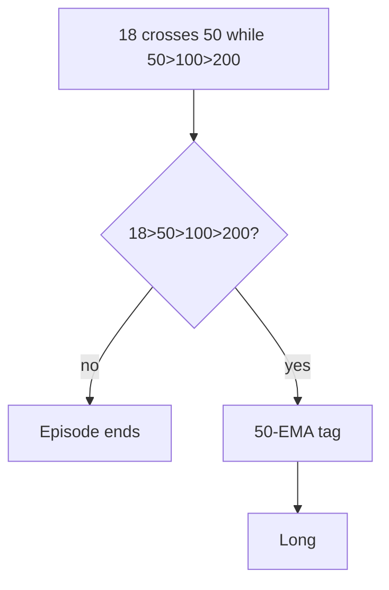

### How to test
- `npm test` — `fullFanUp`, ALGN 2016-02-24 rejected, `tradeChartRange` default 80/20
- UI: Backtest → run → click a row. Chart should show four stacked EMAs over a wider window

---
## 2026-08-24 — Click a backtest row for the trade chart

### What changed
Recent-entry rows open a candlestick window around that trade: entry triangle, exit square, stop/entry (and target if not trailing) lines, EMA 18/50, plus copy that explains the exit.

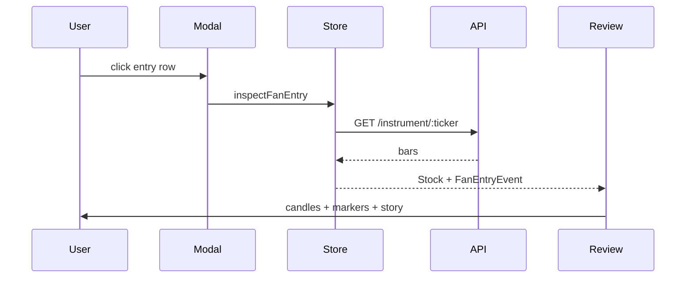

### How to test
- `npm test` — `explainFanTrade`, `inspectFanEntry`
- UI: Backtest → run → click a row → ← Results

---

## 2026-08-24 — Default to tag50 + trail 50

### What changed
Shipped the sweep winner as the product default:

- Entry: 50-EMA tag (not full structure)
- Exit: trail the 50 after 1R breakeven
- MACD window off by default; if turned on, it filters entry only and does **not** cut a trailed trade

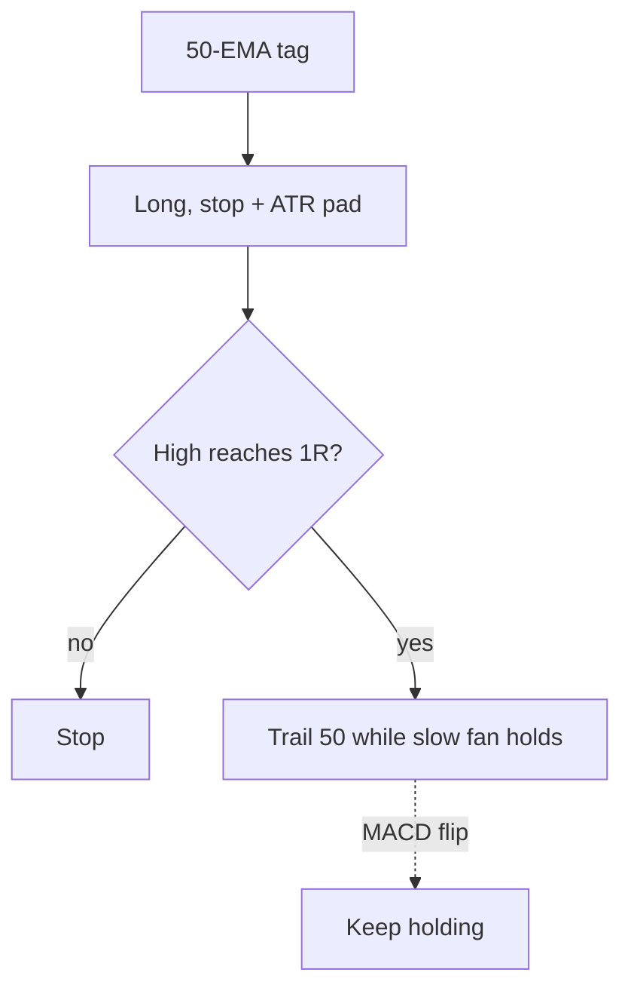

### How to test
- `npm test` — `src/lib/fanBacktest.test.ts`, `server/fanBacktest.test.ts`
- UI: Backtest opens on 50-EMA tag / Trail 50-EMA / MACD unchecked; click a recent-entry row for the trade chart

---

## 2026-08-24 — Fan backtest config sweep

### What changed
Ran the live engine across two datasets (kaggle 2014–17, 1,460 names; dev 2018–23, 488 names). Extra indicators scored at the entry bar only.

| Knob | Result |
|---|---|
| Default structure 3R | 0.14R / 0.22R |
| tag50 + trail 50, MACD exit off | **0.67R / 0.52R** |
| MACD as exit while trailing | Blocks the trail (43% of tag18+trail exits) |
| RSI / ADX / volume / classic MACD as entry | Do not replicate |
| StochRSI K > 80, tag >3% above EMA50 | Soft skips only |

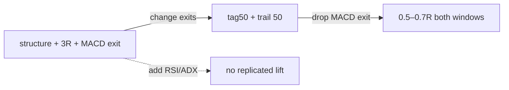

### How to test
Open the evaluation canvas beside chat. Product default is now tag50 + trail 50, MACD off; MACD does not cut a trailed trade even if re-enabled.

---

## 2026-08-24 — Entry/exit/continuation rules for fan backtest

### What changed
Research against EMA-stack / pullback literature (bone zone, MA bounce, 1R→breakeven, trail the stack) vs the old “one tag, hard 3R, time stop” engine:

| Decision | Before | Now |
|---|---|---|
| Entry | First 50-tag only, required ≥1 lower low + 2-bar reversal | 18-EMA bone-zone tag; first touch (0–2 lower lows); reversal **or** rejection wick; rising 50 filter |
| Continuation | Episode died after one fill | Re-arm on a new swing high; one open trade per name |
| Stop | Exact pullback/50 | Same structure, padded 0.25 ATR(14) |
| After 1R | Hold original stop to 3R | Default: stop → breakeven |
| Exit | Hard 2/3/4R + always-on time stop | Optional **trail 50-EMA**; time stop skipped while trailing a live slow fan |

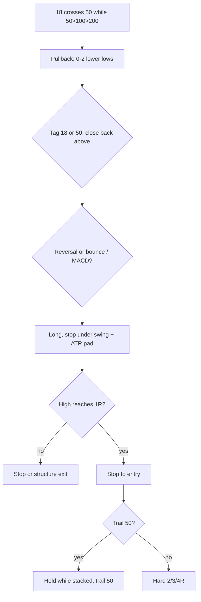

### How to test
- `npm test` — `src/lib/fanBacktest.test.ts`, `server/fanBacktest.test.ts`
- UI: Backtest → 18-EMA tag / Trail 50-EMA / continuation + breakeven checkboxes

## 2026-08-24 — Structured fan strategies + 1R/3R

### What changed
Backtest is no longer only “buy fan onset.” Strategies, long-only:

1. **Fan onset** — baseline, first `18>50>100>200`
2. **Continuation cross** — 18 crosses up 50 while `50>100>200`
3. **50-EMA tag** — first bounce after that cross, ≤2 lower lows
4. **Full structure** (default) — tag + 2-bar reversal + 18–50 MACD window
5. **Dual-EMA test** — structure that trades through 18 and 50

Shared risk: 1R under `min(pullback low, EMA50)`, target 2/3/4R. Same-bar stop+target → stop (conservative). MACD line = EMA18−EMA50, signal = 9-EMA.

### How to test
- `npm test` — `src/lib/fanBacktest.test.ts`
- UI: Backtest → strategy dropdown → compare expectancy in R vs onset

## 2026-08-24 — Fan entry backtest (buy / stop / hold)

### What changed
Added a universe backtest for EMA-fan **entry signals** with simulated trade management:

- **Entry**: transition into `match` (full stack) or `near` (approaching)
- **Stop loss**: % drawdown and/or close below EMA 50/100/200
- **Continue / exit**: hold while stacked; optional exit when fan breaks; max hold bars
- **Output**: forward-return horizons (naive), simulated trade stats, recent entry table with dates

Engine: `src/lib/fanBacktest.ts`. API: `POST /backtest` (NDJSON progress + result). UI: **Backtest** button in top bar → modal.

### How to test
- `npm test` — `src/lib/fanBacktest.test.ts`, `server/fanBacktest.test.ts`
- `npm run dev` → Backtest → Run backtest

## 2026-08-24 — Volume, cap, price, and sector filters

### What changed
Added a filter bar below the top bar with dropdowns for avg volume (20d), market cap, min price, and sector. Filters apply client-side to both fan lists after search. `FanRow` now carries `avgVol20`, `relVol`, and `marketCap`. Synthetic data sets deterministic `sharesOutstanding`; imported SQLite DBs without shares leave `marketCap` null.

### How to test
- `npm test` — `src/lib/filters.test.ts`, `src/store.test.ts`
- `npm run dev` — filter bar under the top bar

## 2026-08-24 — Close-to-fan means entering, not sitting near

### What changed
Near is no longer “worst pair inverted by ≤ 0.5% on the last bar.” It is **approaching the stack after being out**:

1. not a match now
2. worst adjacent gap ≥ −0.5%
3. enough history (`n > FAN_ENTER_LOOKBACK`, 10 bars)
4. `worstGap_now > worstGap_(n − 10)` — improving, not exiting

Match is unchanged (strict `18 > 50 > 100 > 200` on the last bar). Snapshot geometry stays in `classifyFan`; the product rule is `classifyFanSeries` / `classifyCloses`.

### Architecture impact
```mermaid
flowchart TD
  Last[last-bar classifyFan] --> Match{all gaps > 0?}
  Match -->|yes| M[match]
  Match -->|no| Close{worstGap >= -0.5%?}
  Close -->|no| X[none]
  Close -->|yes| Hist{n > 10?}
  Hist -->|no| X
  Hist -->|yes| Imp{now gap > gap 10 bars ago?}
  Imp -->|yes| N[near]
  Imp -->|no| X
```

### How to test
- `npm test` — `src/lib/fan.test.ts` (entering vs exiting vs flat)
- `npm run dev` — right list = approaching the stack, not sitting near it

## 2026-08-24 — EMA-fan two-list screener

- **EMA fan** — `ema18 > ema50 > ema100 > ema200`
- **Close to fan** — not a match, but the worst adjacent pair is inverted by ≤ 0.5%, sorted closest-first

`classifyFan` / `screenFan` in `src/lib/fan.ts` own that rule. `POST /screen` returns `{ matches, near }`. The React app is two tables plus an overlay chart (candles + four EMAs). Composer UI, backtest, and the rule-based screen request are gone.

### Architecture impact
```mermaid
flowchart LR
  Yahoo[yahoo-fetch / eod-import] --> DB[(SQLite)]
  DB --> Universe[buildUniverse]
  Universe --> Fan[classifyFan]
  Fan --> API["POST /screen { matches, near }"]
  API --> UI[two lists + overlay chart]
```

```mermaid
flowchart TD
  E18[EMA18] -->|gap| E50[EMA50]
  E50 -->|gap| E100[EMA100]
  E100 -->|gap| E200[EMA200]
  E18 --> C{all gaps > 0?}
  C -->|yes| M[match]
  C -->|no, worstGap >= -0.5%| N[near]
  C -->|else| X[none]
```

The general rule engine in `src/lib/market.ts` and `src/lib/dag/` still exist for `buildStock` / golden tests; they are not on the live screen path.

### How to test
- `npm test` — includes `src/lib/fan.test.ts` and `server/screen.test.ts`
- `npm run dev` then open the app: left list = stacked fan, right list = within 0.5%
- Click a row for price + EMA overlay
- `curl -s -X POST http://localhost:8787/screen -H 'content-type: application/json' -d '{}'`
