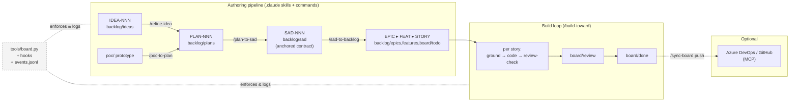
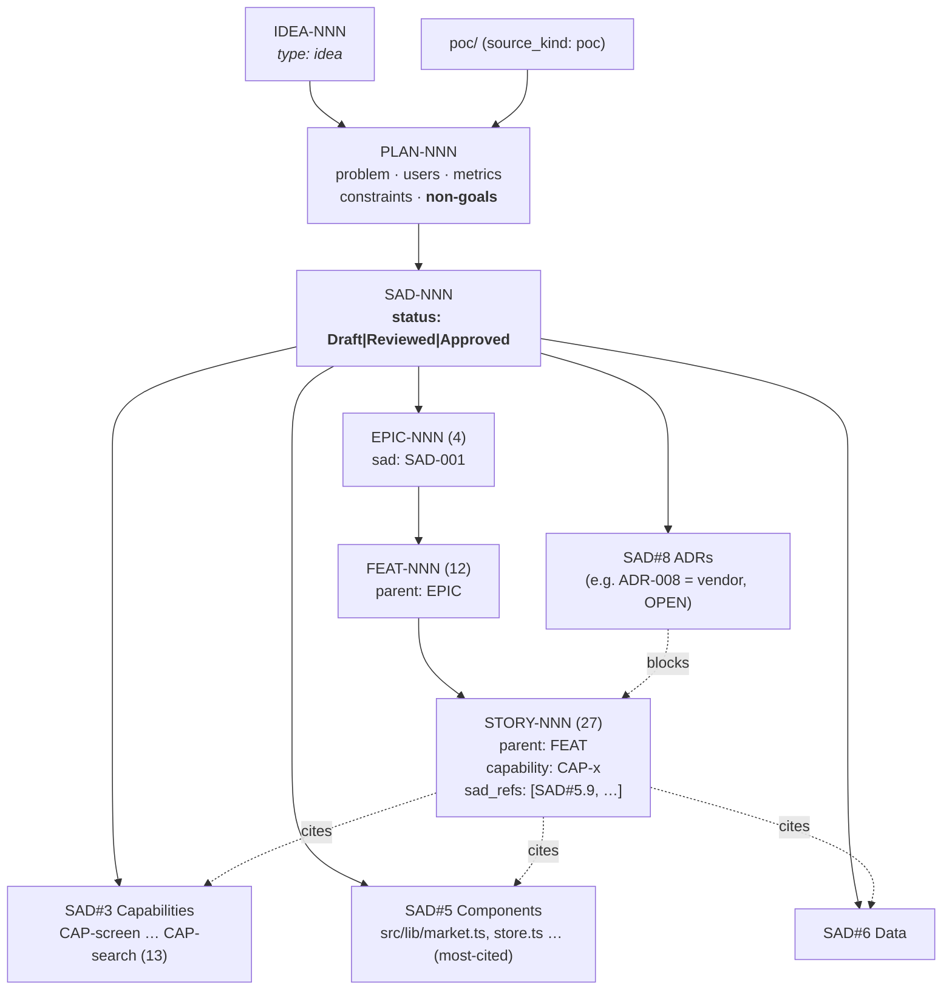
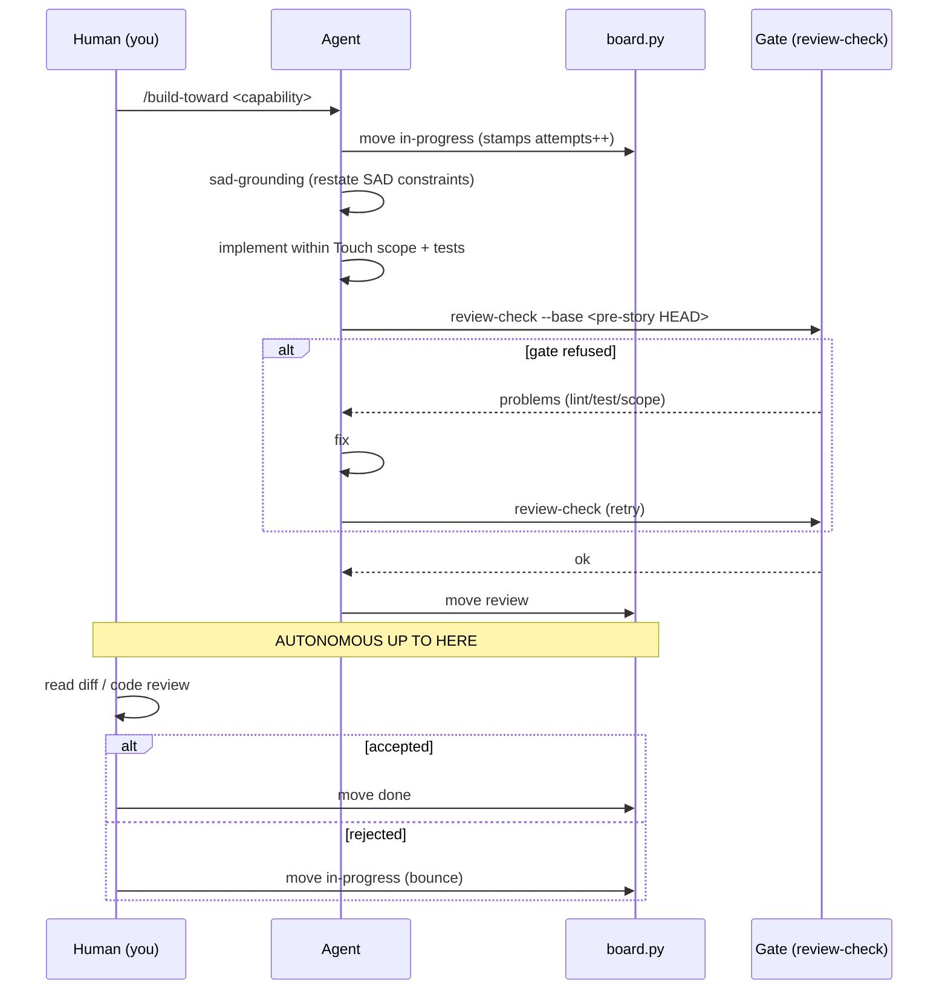
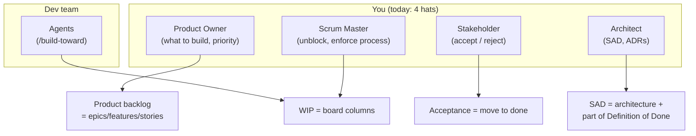
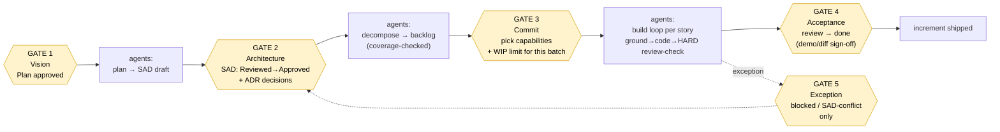
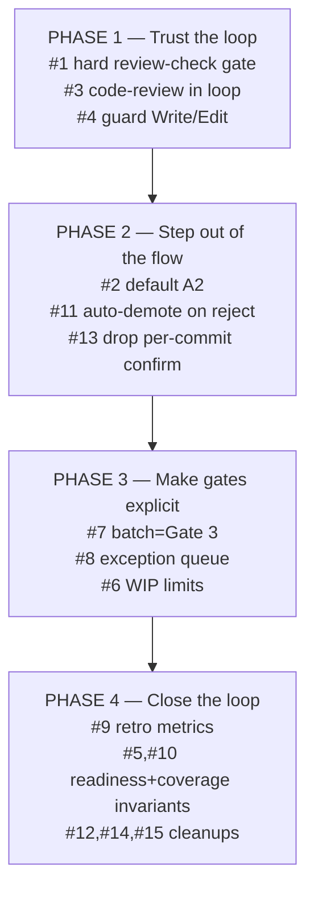
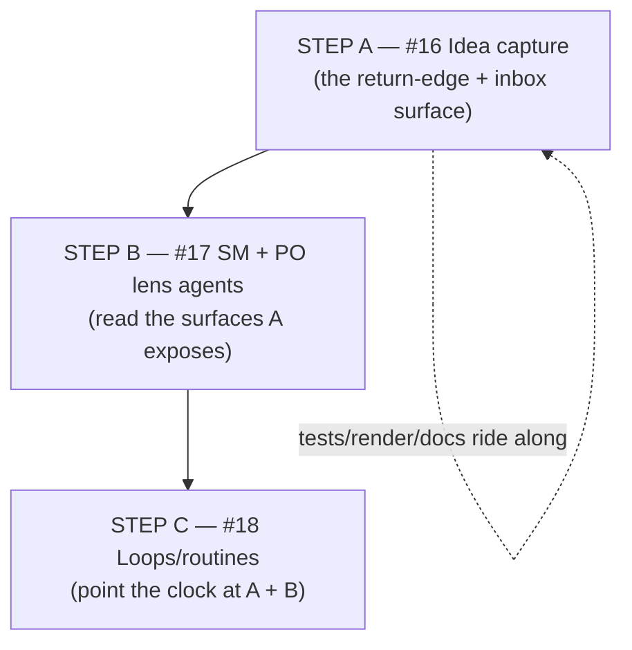

# Work-process analysis: the semi-autonomous backlog system

_Status: analysis & proposal — 2026-06-24_
_Scope: `.claude/`, `.workflow/`, `backlog/`, `docs/`, `tools/`_
_Method: four parallel read-only analyses (pipeline skills, enforcement tooling, event-log telemetry, backlog artifacts), synthesised here._

---

## 0. Why this document exists

You are building a system where **agents do the software work and you stay out of the
general flow**, stepping in only at decision points that genuinely need a human. This
document does three things:

1. **Describes the system as it actually is today** — the authoring pipeline, the
   enforcement layer, and the workflow as it really ran (reconstructed from
   `.workflow/events.jsonl`, not from how it's _meant_ to run).
2. **Holds it up against Scrum / Kanban** to name what you've already got, what you're
   missing, and which agile ideas are worth borrowing.
3. **Proposes a target operating model** — the specific points where you stay in the
   loop, the places you can step out, and the concrete `add / change / remove` moves
   to get there.

The headline finding: **you have built a Kanban system with an unusually strong
_traceability_ backbone and a partially-enforced _quality_ gate. The path to "remove
myself from the flow" is not more automation of the middle — that part already runs
itself — it is (a) closing the two enforcement gaps that currently force you to babysit
quality, and (b) introducing a small number of _explicit_ human checkpoints so that
"in the loop" means five named gates instead of ambient supervision.**

---

## 1. The system in one picture



Three layers stacked on top of each other:

| Layer | What it is | Where it lives |
|---|---|---|
| **Authoring pipeline** | A linear refinement chain: raw idea (or POC) → project plan → Software Architecture Document (SAD) → epic/feature/story backlog. Each stage is a Claude Code _skill_ + _slash-command_ pair that reads the previous artifact and writes the next. | `.claude/skills/*`, `.claude/commands/*` |
| **Build loop** | `/build-toward <capability>` pulls stories matching a capability, and for each one grounds the agent in the SAD, implements within a declared file scope, and runs a quality gate before advancing the board. | `.claude/commands/build-toward.md`, `sad-grounding` skill |
| **Enforcement & telemetry** | A single sanctioned mutation tool (`board.py`), three hooks that block illegal moves and log everything, and an append-only event log. The board's _state is the folder structure_ — a story's column is the directory it sits in. | `tools/board.py`, `tools/hooks/*`, `.workflow/events.jsonl` |

---

## 2. The artifact backbone (what flows through the pipe)



**The grounding guarantee.** Every buildable unit cites a permanent SAD anchor, and
nothing is built that isn't anchored. This is enforced at three depths:

- **Authoring prose** — the `backlog-decomposer` skill prints a coverage table and
  refuses to silently invent work.
- **Decomposer invariants** — every story must have ≥1 `sad_refs`, exactly one
  `capability` under `SAD#3`, and must not build anything listed in `SAD#1.2`
  (out-of-scope).
- **Runtime gates in `board.py`** — you _cannot_ move a story to `in-progress` with
  empty `sad_refs` ("cannot start untraceable work"), and `validate` walks every
  `sad_refs` anchor against the SAD text, flagging dangling refs and unknown
  capabilities.

**Anchors are immutable** ("never renumber an anchor once stories reference it — append
instead"), which is what makes `sad_refs` durable over time.

**Verified state of the real backlog:** all 27 stories have a non-empty `parent`,
`capability`, and `sad_refs`; every parent chain (`story → feature → epic → SAD-001 →
plan → poc`) resolves end-to-end. The traceability is genuinely populated, not
aspirational.

---

## 3. The board state machine (as enforced)

The board is five folders under `backlog/board/`. `board.md` at the repo root is a
**generated view** — the folders are the source of truth.

```mermaid
stateDiagram-v2
    [*] --> todo: board.py new\n(auto-assign STORY-NNN)
    todo --> in_progress: move\n(REFUSED if sad_refs empty;\nstamps attempts++)
    in_progress --> review: move\n(review-check SHOULD pass)
    review --> done: move\n(REFUSED if any [ ] unchecked)
    review --> in_progress: bounce (rework)
    in_progress --> todo: demote

    todo --> blocked: move --reason\n(stamps prev_column)
    in_progress --> blocked: move --reason
    review --> blocked: move --reason
    blocked --> in_progress: unblock\n(returns to prev_column)

    done --> [*]

    note right of review
        no forward skips:
        todo → review is refused,
        must pass through in-progress
    end note
```



**What the machine protects you from (mechanically):**

- Illegal transitions — forward skips refused; you must walk the path.
- Starting untraceable work — empty `sad_refs` blocks `in-progress`.
- Closing with unmet criteria — any unchecked `- [ ]` blocks `done`.
- Manual board tampering — `mv`/`cp`/`git mv`/`rm` on a story file is denied by a
  hook; `board.py` is the only sanctioned path. (This guard fired and stopped an agent
  three separate times in the log — agents kept trying the `git mv` shortcut.)
- Silent test-gaming — `review-check` flags deleted test files, removed test cases,
  removed assertions, added skips, and weakened asserts.

**What is still left to trust (the gaps — see §6):**

- **`review-check` is _not_ wired into the `done` gate.** Moving to `done` checks only
  that the criteria boxes are ticked. Nothing forces `review-check` to have run or
  passed. _This is the single biggest enforcement gap._
- **No `## Touch scope` section = a pass**, not a failure. Scope enforcement is opt-in
  per story.
- **A blanket `*.md` + `tools/` + `backlog/` carve-out** means doc and tooling changes
  never count as out-of-scope.
- **Direct `Write`/`Edit` to a story file is not guarded** — the hook only blocks shell
  `mv/cp/rm`. An agent can tick its own criteria boxes or rewrite `sad_refs` directly.

---

## 4. The workflow as it _actually_ ran

Reconstructed from all 182+ events in `.workflow/events.jsonl` (2026-06-22 → 06-24),
cross-referenced with the git log. One human operator (you), one machine.

### 4.1 What's being logged

| count | tool / event / outcome | meaning |
|---|---|---|
| 60 | board / move / ok | column transitions (the dominant signal) |
| 41 | bash / observed | shell inspection of the backlog |
| 29 | board / new / ok | story creation |
| 21 | file / read / observed | story reads |
| 13 | file / edit / observed | story edits |
| 7 | board / review-check / **refused** | gate caught a problem |
| 6 | board / review-check / ok | gate passed |
| 3 | hook / guard / **refused** | blocked a manual `git mv` |
| 2 | skill / sad-grounding / observed | grounding run before coding |

Two observability eras: **board ops are logged from day one; the fine-grained
file/bash/skill/agent audit trail only begins 2026-06-24 11:14** (the observability hook
was added mid-project). So stories 001–020 have _no_ keystroke-level history — only their
board transitions.

### 4.2 The timeline

```mermaid
timeline
    title As-run history
    2026-06-22 14:47 : 23 stories seeded (STORY-001..023) in two bursts
    2026-06-22 14:50 : "demo sweep" — STORY-001..013 marched todo→done in ~4s, NO commits
    2026-06-23 12:40 : First REAL loop — STORY-014 (provider port), review-check refused x2 then ok
    2026-06-23 13:16 : STORY-020 (golden-master) interleaved, clean after 2 refusals
    2026-06-23 14:44 : STORY-014 → done WITH 5 then 4 open review-check problems (human override)
    2026-06-23 16:53 : STORY-015 → blocked (ADR-008 vendor + legal), STORY-016 → in-progress
    2026-06-24 08:39 : STORY-016 → done
    2026-06-24 12:23 : STORY-017 (server backtest) tight clean loop → done in ~17min
    2026-06-24 12:49 : STORY-018 → BLOCKED (data-access architecture gap)
    2026-06-24 12:50 : Agent self-authors STORY-024 as unblocker, ships it in ~11min
    2026-06-24 13:02 : STORY-018 unblocked, implemented → review
    2026-06-24 15:05 : code review finds 10 regressions → STORY-018 BOUNCED to in-progress
    2026-06-24 19:14 : 3 blockers fixed; 7 findings fanned out into STORY-025..029
    2026-06-24 19:26 : STORY-018 still in-progress (the live friction case)
```

### 4.3 The real loop shape (STORY-014 onward)



The clean loop runs itself from `in-progress` to `review`. **You enter at exactly two
points: kicking off `/build-toward`, and the accept/reject decision at `review`.** That
is already close to the goal — but only for the happy path.

### 4.4 Where it actually broke down — STORY-018

STORY-018 is the one story that exercised every failure mode and is the best evidence for
what to fix:

- **4 attempts**, visited `in-progress` three separate times.
- **Self-blocked** on a real architectural gap (removing the full-universe build killed
  the only bar source for detail/compare), then **self-authored STORY-024** as a
  prerequisite and shipped it — good autonomous recovery.
- Shipped to `review`, where a **high-effort code review found 10 regressions** ("data
  access moved to async/streamed service calls without error-state or request-sequencing
  discipline, so failures and races surface as confident wrong answers").
- Only the **3 correctness blockers** were fixed inline; the other 7 findings were
  **deferred into 5 new stories** (025–029) to keep 018 shippable.

Two lessons: (1) `review-check`'s heuristics (tests, scope) **passed** this story — the
real defects were caught only by a _separate, heavier code review_ that isn't part of the
enforced loop. (2) The system handled the overload by **fanning out debt into the
backlog**, which keeps flow moving but defers correctness.

---

## 5. Mapped onto Scrum / Kanban

**What you've actually built is Kanban, not Scrum** — continuous single-piece flow
through columns, no timeboxes, no sprint commitment. That's a reasonable choice for a
one-human-plus-agents shop. Here's the role mapping, which matters because **today you
personally occupy four of the agile roles at once**:



| Agile concept | Present? | In this system |
|---|---|---|
| Product backlog | ✅ strong | `epics / features / stories`, fully traceable to the SAD |
| Backlog refinement | ⚠️ implicit | happens inside `/sad-to-backlog`; no recurring cadence |
| Definition of Ready | ⚠️ thin | only "`sad_refs` non-empty" is enforced; no readiness checklist |
| Sprint / timebox | ❌ absent | pure continuous flow (Kanban) |
| Sprint goal | ◐ partial | the `capability` selector is the closest analogue — a coherent slice |
| WIP limits | ❌ absent | nothing caps how many stories sit in a column |
| Definition of Done | ◐ partial | criteria-ticked is enforced; `review-check` is **not** gated on done |
| Daily standup | ➖ n/a | replaced by `events.jsonl` (the machine's standup) |
| Sprint review / demo | ◐ manual | your accept/reject at the `review` column |
| Retrospective | ❌ absent | no feedback loop reads `events.jsonl` for process metrics |
| Increment | ✅ | a commit + a `done` story per slice |

**The useful borrowings from agile** (developed in §7): a real **Definition of Ready**
and **Definition of Done** (both machine-checkable), **WIP limits** to stop the
fan-out-into-backlog reflex from hiding overload, a lightweight **"sprint" = a batch of
capabilities you commit to** as the planning checkpoint, and an **automated
retrospective** that turns `events.jsonl` into cycle-time / bounce-rate / attempts
metrics.

---

## 6. Friction inventory (evidence-based)

| # | Friction | Evidence | Pulls you in because… |
|---|---|---|---|
| F1 | **`review-check` is advisory, not a `done` gate** | STORY-014 moved review→done with 5 then 4 open problems | you must personally verify quality before every accept |
| F2 | **Real defects slip past the heuristic gate** | STORY-018: 10 regressions found by a _separate_ code review the loop doesn't run | you (or an ad-hoc review) are the only real correctness check |
| F3 | **Overload is hidden by fanning out into backlog** | STORY-018 → 025–029; 018 still in-progress | flow looks healthy while correctness debt accrues silently |
| F4 | **Blocked work needs decisions only you can make** | STORY-015 parked on ADR-008 (vendor + legal sign-off) | legitimate — but there's no queue/notification surfacing it |
| F5 | **The guard fights the agent** | 3× `git mv` refusals; agent never learned | wasted cycles; agents re-trip the same guard |
| F6 | **`## Status` prose duplicates folder-truth and goes stale** | STORY-018 body says "DONE (pending review)" while sitting in `in-progress` with all boxes `[x]` | you can't trust the story body; must cross-check folder |
| F7 | **Demo-sweep pollution** | STORY-001–013 marked done in 4s, no commits | board overstates completion; real done = 5 stories |
| F8 | **Coverage / out-of-scope / SAD-status invariants are prose-only** | decomposer told to check; `board.py validate` doesn't | silent capability drops or Draft-SAD decomposition rely on you noticing |
| F9 | **Rejected review stories don't auto-re-enter the loop** | `build-toward` only picks `{todo, in-progress}` | you must manually demote a bounced story |
| F10 | **Manual ID assignment for plan/SAD/epic/feature** | only `board.py new` auto-numbers | small but invites collisions; another manual touch |

Note that **F1, F2, F6, F7, F8** are largely _already on your own backlog_ as
STORY-025–029 (races, error-states, reconnect, bootstrap, reseed) and board chores —
which is itself evidence the system surfaces its own debt well.

---

## 7. Target operating model — "five gates, autonomous between them"

The goal isn't more automation in the middle; that already runs. The goal is to make
"in the loop" **discrete and explicit** so everything _not_ a gate is, by definition,
yours-to-ignore. Five human gates:



| Gate | You decide | Why it can't be delegated | Today |
|---|---|---|---|
| **1 — Vision** | Is this the right problem/scope? Plan's non-goals correct? | Product intent is yours | ✅ already human (idea-refiner interrogates) |
| **2 — Architecture** | SAD `Approved`? ADRs (e.g. ADR-008 vendor) decided? | Architecture + external/legal calls | ◐ soft warning only — _harden_ |
| **3 — Commit** | Which capabilities this batch? WIP limit? | Prioritisation = product strategy | ❌ implicit — _add_ |
| **4 — Acceptance** | Does the increment meet intent? Ship it? | Final accountability | ◐ manual, ungated — _harden_ |
| **5 — Exception** | Resolve a block or SAD conflict | Needs human judgement by definition | ◐ happens, but not surfaced — _add a queue_ |

**Everything between the gates becomes genuinely hands-off** — but only safely so once
the quality gate is real (otherwise stepping back just means defects reach Gate 4 and
bounce, as STORY-018 shows).

### 7.1 The change list (`add / change / remove`)

**CHANGE (these directly buy back your attention):**

1. **Make `review-check` a hard precondition of `move done`** (and of `move review`).
   Wire it into `board.py`'s done-gate so a story _cannot_ be accepted unless the gate
   ran against the right `--base` and passed. Closes **F1**. This is the single
   highest-leverage change — it's what lets you trust the loop enough to leave it.
2. **Flip the default tier from A1 → A2.** A1 confirms every commit (you in the flow
   constantly); A2 runs the whole story to the `review` column autonomously and stops
   there. A2 _is_ the "remove myself from the general flow, keep the merge gate" model.
   (Reserve A1 for when architecture is still settling.)
3. **Promote the heavy code review into the loop.** The defects in STORY-018 were caught
   by an out-of-band review, not `review-check`. Add an agent-run review pass (a
   `code-review` style step) as part of the build loop _before_ `move review`, so Gate 4
   sees pre-reviewed work. Closes **F2**.
4. **Extend the guard hook to `Write`/`Edit` on story files**, or have it allow body/AC
   edits only through `board.py`. Closes the "agent ticks its own boxes" half of **F6**.

**ADD (these make the gates explicit and the middle observable):**

5. **A machine-checkable Definition of Ready** beyond `sad_refs` — e.g. acceptance
   criteria present and non-placeholder, `Touch scope` declared (remove the "no scope =
   pass" loophole), capability valid. Run it at `move in-progress`. Tightens **F8**.
6. **WIP limits per column in `board.py validate`** (e.g. max N `in-progress`). This
   turns the "fan out debt into the backlog" reflex (**F3**) into a visible signal —
   when WIP is full you're forced to finish or explicitly decide to defer, at Gate 3,
   not silently.
7. **A "batch / sprint" concept as Gate 3.** Not timeboxes — a named set of capabilities
   you commit `/build-toward` to, recorded as an artifact. This is your prioritisation
   checkpoint; between batches the agents just work the list.
8. **An exception queue + notification for Gates 2/5.** Surface blocked stories and
   SAD-conflicts (STORY-015 / ADR-008 style) in one place that pings you, so "in the
   loop on exceptions" doesn't mean "watching the stream." Closes **F4**.
9. **An automated retrospective from `events.jsonl`** — cycle time per story, review-
   check refusal rate, bounce rate, `attempts` distribution, blocked-duration. A
   `board.py metrics` command or a scheduled digest. This is the agile feedback loop the
   system currently lacks, and it's free given the event log already exists.
10. **Mechanise decomposer invariants in `board.py validate`** — capability coverage
    (every `SAD#3` cap has ≥1 story or explicit deferral) and the `SAD#1.2` out-of-scope
    check; block decompose/validate on a non-`Approved` SAD. Closes **F8**.
11. **Auto-demote on reject:** when you bounce a story at Gate 4, have it return to
    `in-progress` so `/build-toward` re-picks it without a manual move. Closes **F9**.

**REMOVE (delete sources of manual touch / false signal):**

12. **The duplicated `## Status` prose section.** It contradicts folder-truth and goes
    stale (**F6**). Either drop it and let the column + a generated digest be the only
    status, or auto-generate it from board state on render.
13. **Per-commit human confirmation by default** — a consequence of change #2 (A1→A2).
14. **Manual ID assignment** for plans/SADs/epics/features — extend `board.py new`'s
    auto-numbering to those types (**F10**).
15. **Re-seed away the demo-sweep "done" pollution** (already filed as STORY-029) so the
    board stops overstating completion (**F7**).

### 7.2 Sequencing (smallest set that frees you fastest)



Phase 1 is the prerequisite for everything: **you cannot safely leave the flow until the
gate is real.** Once Phase 1 + 2 land, your day-to-day collapses to Gates 3 and 4 (pick a
batch, accept the results) plus exception pings — which is the goal.

---

## 8. The meta-layer: idea-capture, standing roles, and a clock

§7 fixes the _pipeline_. This section adds the layer that sits **above** it and makes the
five-gate model sustainable — the answer to three questions: can the workflow capture new
ideas from anywhere, can `/loop` drive it, and can agents play Scrum Master / Product
Owner. They are not three features; they are one **meta-layer that watches and feeds the
pipeline** instead of being another stage inside it.

The pipeline today is a straight line (idea → … → done). The meta-layer turns it into a
**cycle with a heartbeat**:

```mermaid
flowchart LR
    subgraph FUNNEL["Idea funnel (firewalled from build)"]
        INBOX["backlog/ideas inbox\nauto-captured + provenance"]
    end

    INBOX -->|"GATE 1\nhuman triage"| PLAN["plan → SAD → backlog"]
    PLAN --> BUILD["build loop\nground→code→HARD review-check"]
    BUILD --> DONE["done"]

    BUILD -. "discovery: in-scope\n(anchored to SAD)" .-> PLAN
    BUILD -. "discovery: OUT of scope\n(needs new SAD/ADR)" .-> INBOX

    PO["PRODUCT OWNER lens (agent)\nvalue · scope · priority"]:::lens
    SM["SCRUM MASTER lens (agent)\nflow · process · health"]:::lens
    PO -. triages .-> INBOX
    PO -. "proposes batch → GATE 3" .-> PLAN
    SM -. watches events.jsonl .-> BUILD
    SM -. "exception queue → GATE 5" .-> DONE

    CLOCK(["/loop + scheduled routines\n= the clock"]):::clock
    CLOCK -. drives .-> PO
    CLOCK -. drives .-> SM
    CLOCK -. "drives (after Phase 1 only)" .-> BUILD

    classDef lens fill:#e7f0ff,stroke:#4a78c0,color:#000;
    classDef clock fill:#eafaea,stroke:#3a9d3a,color:#000;
```

### 8.1 Idea capture — the missing return edge (Q1)

**Verdict: yes — build it, with auto-capture / human-triage.** Today ideas only legally
enter at the top of the funnel, and `backlog/ideas/` is in fact **empty** — no real
`IDEA` has ever been filed (the project entered at PLAN level from the POC). Yet the
telemetry shows net-new work is discovered _mid-flow_ constantly (STORY-024 self-authored
as an unblocker; STORY-025–029 spun out of the 018 review). The pipeline has no
sanctioned path for a discovery to travel **back up** to the idea stage, so a good idea
found while coding has only two exits today, both bad:

- **smuggle it into the current story** → the exact scope-creep the SAD valve exists to
  block; or
- **drop it** → lost.

The fix is a one-command capture (`board.py idea-new` / a small skill) that any agent or
human can fire from anywhere, writing `IDEA-NNN` to the inbox **with provenance** (born
from which story, found by whom, why it's out of scope). Crucial design rules:

- **Capture ≠ commit.** The inbox is **firewalled from the build loop** — an idea is not
  a story and cannot be built until a human promotes it through Gate 1 → plan → a SAD
  amendment/ADR. This is what keeps "capture from anywhere" from becoming "scope creep
  from anywhere."
- **Distinguish the two discovery types explicitly.** _In-scope_ discovery (anchored to
  an existing `SAD#3` capability) → a new **STORY** (existing path, already works).
  _Out-of-scope_ discovery (needs architecture the SAD doesn't have) → an **IDEA** in the
  inbox. Today STORY-025–029 blur this line; the inbox gives the out-of-scope half a real
  home.
- **Triage stays a human gate.** Otherwise the inbox fills with agent-imagined features.
  Ideas not promoted within N cycles auto-archive so the inbox stays signal.

This closes the funnel into a loop and directly relieves **F3** (out-of-scope findings no
longer have to masquerade as in-scope stories).

### 8.2 Two standing roles as lenses (Q3)

**Verdict: yes — this is the highest-value addition, because it's how you take off the
hats in §5.** Every agent today looks _vertically_ at one story; nothing looks
_horizontally_ across the board. Add two **advisory** agents — they prepare and enforce,
they do **not** decide:

| | **Scrum Master lens** | **Product Owner lens** |
|---|---|---|
| Angle | flow & process — _how_ the work moves | value & scope — _what_ is worth moving |
| Reads | `events.jsonl` + board folders | backlog vs SAD + plan success-metrics + idea inbox |
| Detects | WIP breaches, stalled/aging stories, climbing `attempts`, blocked items, guard-fights (F5), review-check refusal patterns, demo-sweep pollution (F7) | capability-coverage gaps (F8/#10), SAD drift, out-of-scope creep, stale ideas |
| Produces | the **retro/health digest** (#9) and the **exception queue** (#8) that pings you at Gate 5 | a **proposed next batch** (prioritised, anchored) for Gate 3, and **idea-inbox triage** recommendations for Gate 1 |
| Delegability | **High** — the SM job is mostly rules; delegate it almost entirely | **Prep only** — the PO _prepares_ the decision; you still own prioritisation (it's product strategy) |

The framing that makes this safe and useful: **agents prepare and enforce; the human
decides at the gates.** These roles add **no sixth gate** — they make the existing five
_cheaper_. The PO lens turns Gate 3 from "stare at nine todo stories" into "approve or
adjust this proposed batch." The SM lens turns Gate 5 from "watch the stream for trouble"
into "respond to a surfaced exception." The standing risk — two agents emitting reports
nobody reads — is avoided by the rule that **every SM/PO output must land at a gate or it
isn't built**. The PO lens proposes ordering of _existing anchored work_ and triages the
inbox; it never invents scope.

This is the concrete mechanism for retiring the four-hats picture in §5: **SM hat →
delegated to an agent; PO hat → agent-prepared, human-decided; Stakeholder + Architect →
stay human (Gates 4 and 2).**

### 8.3 `/loop` as the clock (Q2)

**Verdict: yes — `/loop` is the system's heartbeat, but partition it by risk and gate the
action loops behind Phase 1.** A Kanban system has no timeboxes and therefore no natural
cadence; `/loop` (and scheduled cloud routines for overnight runs) is how you give it one
without standing up meetings. Three uses, two risk classes:

| Loop | Class | Safe to add | Notes |
|---|---|---|---|
| SM health sweep + PO batch-prep | **observation** | **now** | reads state, emits to a gate; cannot harm flow. The natural home for #6/#8/#9. |
| Idea-inbox triage nudge | **observation** | **now** | surfaces fresh ideas at a cadence for Gate 1. |
| `/loop /build-toward <batch>` until dry | **action** | **only after Phase 1** | scales output **and defects**; safe only once `review-check` is a hard gate (#1) and review is in-loop (#3). Must carry the **WIP/batch bound (#6) as its stop condition** or it churns. |

So the sequencing already in §7.2 still holds: **observation loops can light up
immediately and start buying back your attention; the build loop only becomes a safe
`/loop` target after Phase 1.** A practical split: in-session `/loop` for "work this batch
while I'm here," and a **scheduled routine** (cron-style) for the nightly SM retro digest
so the heartbeat survives across sessions.

### 8.4 How the meta-layer extends the change list

These fold into §7.1 as three additions (call them **#16–#18**) and naturally belong in
the later phases, since they presuppose the gate is real:

- **#16 — Idea-capture command + inbox** (`backlog/ideas/` as a real, provenance-stamped
  inbox; `board.py idea-new`; firewalled from build). _Phase 3._
- **#17 — Scrum Master + Product Owner lens agents**, each wired so its output lands at a
  specific gate (SM → Gates 5/retro; PO → Gates 1/3). _Phase 3–4._
- **#18 — Loops/routines as cadence** — observation loops in Phase 3; the `/build-toward`
  action loop only in/after Phase 2→Phase 1-complete, bounded by WIP. _Phase 3+._

---

## 9. Bottom line

- **You've already built the hard part:** a fully-traceable, anchor-grounded backlog and
  a board state machine that mechanically prevents untraceable starts, unmet-criteria
  closes, and manual tampering. The middle of the flow genuinely runs itself.
- **The reason you're still in the flow is two enforcement gaps, not missing
  automation:** `review-check` is advisory rather than a `done` gate (F1), and it can't
  see the defects a real code review catches (F2). Until those close, "stepping back"
  just relocates your attention to cleaning up at the review column.
- **The agile move that fits is Kanban-with-gates, not Scrum ceremonies:** a real
  Definition of Ready and Done, WIP limits, a batch-commit checkpoint, and an automated
  retro off `events.jsonl`. These convert ambient supervision into **five discrete
  gates** — Vision, Architecture, Commit, Acceptance, Exception — and make everything
  between them legitimately ignorable.
- **STORY-018 is the system working as intended under stress** (self-block → self-author
  prerequisite → bounce → fan-out) _and_ the proof of the gaps (the bounce came from a
  review the loop doesn't run). Treat it as the regression test for the target model:
  re-run that scenario after Phase 1 and the 10 findings should be caught _before_ Gate
  4, not after.
- **A meta-layer makes the gates sustainable, not just present (§8):** an idea-capture
  inbox turns the straight pipeline into a cycle so discoveries stop having to masquerade
  as in-scope stories; two advisory lenses (Scrum Master for flow, Product Owner for
  value) let you _take off the four hats_ by preparing and enforcing the gate decisions
  you still own; and `/loop` plus scheduled routines give the timebox-free Kanban a
  heartbeat. The rule that keeps it honest: **agents prepare and enforce, the human
  decides at the gates** — and the build loop only becomes a safe `/loop` target once
  Phase 1 has made the quality gate real.

---

## 10. Meta-layer implementation plan (§8 → buildable steps)

_Added 2026-06-25. Phases 1–4 of §7 are landed (see git history); this section turns the
§8 meta-layer (#16–#18) into a concrete, ordered build. **Decision (locked):** the two
lenses are built as **advisory agents in `.claude/agents/` plus thin slash-commands** —
the agent prompt carries the judgement, `board.py` supplies the data. They never mutate
the board; they prepare decisions that land at a gate._

### 10.0 Guiding invariants (carry into every step)

- **Capture ≠ commit.** An idea is not a story and cannot reach the build loop without a
  human at Gate 1. The inbox is firewalled from `backlog/board/`.
- **Agents prepare and enforce; the human decides at the gates.** No SM/PO output is
  self-acting, and the meta-layer adds **no sixth gate** — it makes the existing five
  cheaper.
- **Every lens output must land at a named gate** (SM → Gate 5/retro; PO → Gate 1/3) or
  it isn't built. No orphan reports.
- **The PO lens never invents scope** — it orders existing anchored work and triages the
  inbox; it cannot author stories.

### 10.1 Recommended order of implementation



The order is dependency-driven, not preference: **#16 first** because the idea inbox is
the surface the PO lens (#17) triages and the triage loop (#18) nudges; **#17 next**
because the lenses are what the loops (#18) actually run; **#18 last** because a clock
with nothing to drive is noise. Within each step, tests + `render` + doc updates ride
alongside rather than trailing.

Build **Step A end-to-end and stop for review** before Step B — it is the smallest safe
increment and everything downstream depends on its shape.

---

### STEP A — #16 Idea capture (do first, then review)

**Goal:** a one-command, provenance-stamped return-edge so a discovery found mid-flow has
a sanctioned home instead of being smuggled into the current story (F3) or dropped.

1. **A1 — Enrich `backlog/ideas/IDEA.template.md` with provenance frontmatter.** Add
   `status: inbox`, `captured: <date>`, `discovery_type: out-of-scope`, `born_from:`
   (origin story id), `found_by:`, and a `why:` line (what SAD section / ADR the idea
   would need). Today the template is 6 lines and carries none of this.
2. **A2 — Add `board.py idea-new`.** Auto-number `IDEA-NNN` (reuse `_next_item_id`;
   `IDEA_ID` regex already exists), stamp provenance from flags
   (`--title`, `--born-from`, `--why`, `--found-by`), default `discovery_type` to
   `out-of-scope`, write to `backlog/ideas/`, and `_log("idea-new", …)`. Implement as a
   dedicated `cmd_idea_new` (provenance handling is richer than the generic
   `cmd_new_item`); register the subparser next to `new-*`.
3. **A3 — Add `board.py idea-list`.** Print the inbox (id, `born_from`, age from
   `captured`, `status`) with a `--json` mode, mirroring `batch-list`/`exceptions`. This
   is the surface the PO lens (Step B) and the triage loop (Step C) read.
4. **A4 — Make the firewall explicit in `board.py validate`.** Add a check that no story
   `parent` resolves *directly* to an `IDEA-NNN` (the legal chain is
   story→feature→epic→SAD→plan→idea). Ideas are already physically firewalled (the build
   loop only picks `board/todo`); this makes smuggling a *validation failure*, not a
   convention. Closes the F3 back-door.
5. **A5 — Stale-idea archival.** ✅ LANDED (2026-06-27). `board.py idea-archive
   [--days N] [--dry-run]` uses the `captured` stamp to move `status: inbox` ideas
   older than `STALE_IDEA_DAYS` (90, a constant alongside `DEFAULT_WIP_LIMIT`) to
   `backlog/ideas/archive/`, flipping status→`archived` + stamping the date; promoted
   ideas are spared. `idea-list` flags stale ideas, `validate` nudges (non-blocking).
   Tests in `tools/tests/test_board_sprint.py`.
6. **A6 — `/capture-idea` thin command.** ✅ LANDED (2026-06-27).
   `.claude/commands/capture-idea.md` — a wrapper any agent or human fires from
   anywhere mid-flow. Its prose makes the discovery-type fork explicit: **in-scope**
   (anchored to an existing `SAD#3` capability) → a new **STORY** via the existing path;
   **out-of-scope** (needs architecture the SAD lacks) → `idea-new`. The unsure default
   is "capture as an idea" (the firewall is recoverable; smuggled scope is not).
7. **A7 — Tests** in `tools/tests/test_board_gates.py`: `idea-new` numbering + provenance,
   the firewall `validate` rule (a story parented on an IDEA fails), and stale-archive.
8. **A8 — `board.py render`** lists the idea inbox in `board.md` and `render-html`.
   ✅ LANDED (2026-06-27). `render` writes a trailing `## Idea inbox` section
   (id · age · `born_from` · STALE flag, with the capture≠commit firewall note);
   `render-html` adds an **Idea inbox** tab (provenance + staleness per idea) plus a
   board banner chip. (Batches already surfaced via the §4 "Active sprint" header.)
   Render tests in `tools/tests/test_board_sprint.py`.

_Review gate: stop here. Confirm the inbox shape and firewall before building the lenses._

---

### STEP B — #17 SM + PO lens agents

**Goal:** two horizontal, advisory agents that retire the four-hats picture (§5) by
preparing the Gate 2/3/4/5 decisions you still own. Form: **`.claude/agents/*.md` +
thin `/`-commands** (no `.claude/agents/` dir exists yet — create it).

9. **B1 — Scrum-Master lens** — `.claude/agents/scrum-master-lens.md` + `/sm-health`
   command. Reads `events.jsonl` + board folders; runs `board.py metrics` and
   `board.py exceptions`; emits the **health digest** + **exception queue** that land at
   Gate 5/retro. Detects: WIP breaches, aging/stalled stories, climbing `attempts`,
   guard-fights (F5), review-check refusal patterns, demo-sweep pollution (F7).
   **High delegability** — the job is mostly rules; the agent assembles and explains, it
   does not decide.
10. **B2 — Product-Owner lens** — `.claude/agents/product-owner-lens.md` + `/po-batch`
    command. Reads backlog-vs-SAD coverage + plan success-metrics + `idea-list`; produces
    a **prioritised, anchored proposed next batch** whose landing point is
    `board.py batch-new` (Gate 3), plus **idea-triage recommendations** for Gate 1.
    **Prep only** — it proposes ordering of *existing anchored work* and triages the
    inbox; it must never author a story or invent scope.
11. **B3 — Guardrail wiring.** Both agent prompts state the invariant explicitly:
    *prepare and enforce, never decide; every output names the gate it feeds.* Add a line
    to each `/`-command pointing the human at the gate the output expects.

---

### STEP C — #18 Loops / routines as the clock

**Goal:** give timebox-free Kanban a heartbeat, partitioned by risk. ✅ LANDED
(2026-06-27) — documented in `docs/sprint-ceremonies.md §8` (the cadence section).

12. **C1 — Observation loops (safe now).** ✅ Documented in §8.2 — `/loop` for the SM
    health sweep (`metrics` + `exceptions` + `validate`), PO batch-prep (`/sprint-plan`),
    and the idea-inbox triage nudge (`idea-list`). Read-only; cannot harm flow.
13. **C2 — Scheduled routine for the nightly SM retro digest** (cron-style). ✅ Documented
    in §8.3 — schedule the SM health sweep via `/schedule` so the heartbeat survives
    across sessions, complementing the in-session `/loop`.
14. **C3 — Action loop `/loop /build-toward <batch>` — now eligible** (Phase 1 is
    complete). ✅ Spelled out in `.claude/commands/build-toward.md` ("Driving with /loop")
    and §8.4 — it carries the **WIP/batch bound as its stop condition**, never wall-clock.

---

### 10.2 Closeout

15. **Mark #16–#18 landed in this document** (mirroring how Phases 1–4 were closed) and
    cross off the matching friction items (F3 idea back-edge; the four-hats retirement in
    §5) once Steps A–C are verified. ✅ DONE (2026-06-27) — **all of Steps A–C have
    landed**: #16 (idea capture: `idea-new`/`idea-list`/`idea-archive` + `/capture-idea` +
    the firewall validate rule + the `render`/`render-html` inbox surface), #17 (the SM +
    PO lenses, built as the four advisory agents convened by `/sprint-plan` and
    `/sprint-retro`), and #18 (loops/cadence, documented in `docs/sprint-ceremonies.md
    §8`). **F3** (the idea back-edge) is closed; the four-hats retirement (§5) is realised
    through the advisory lenses. The meta-layer is complete.

---

_Appendix — sources: `.workflow/events.jsonl` (182+ events, 2026-06-22→24); `tools/board.py`,
`tools/hooks/*`, `.claude/settings.json`; `.claude/skills/{idea-refiner,poc-to-plan,sad-author,
backlog-decomposer,sad-grounding,story-syncer}/SKILL.md` and matching `.claude/commands/*`;
`backlog/sad/SAD-001.md`, `backlog/plans/PLAN-001.md`, story files across all board columns;
`docs/autonomy-tiers.md`. Analysis performed by four parallel read-only agents._
