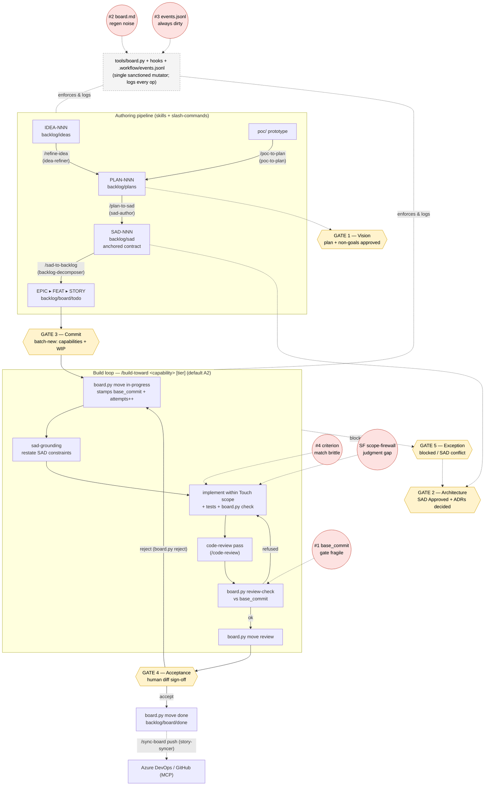
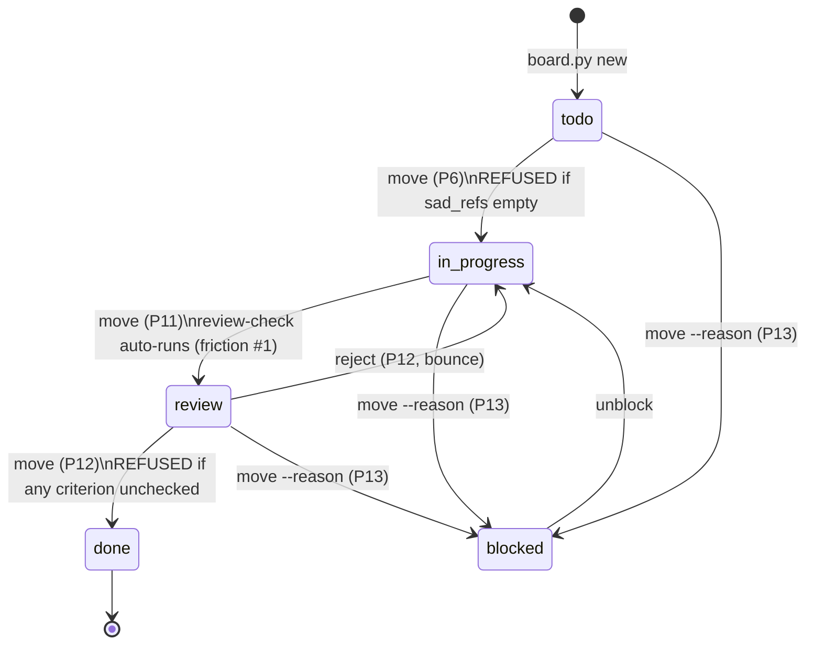

# Workflow friction review

_A candid assessment of what it feels like to do a story end-to-end inside the
backlog-connected workflow (board.py, the SAD skills, the review gates), written
after implementing STORY-025. Companion to [`work-process-analysis.md`](work-process-analysis.md)
and [`autonomy-tiers.md`](autonomy-tiers.md)._

## Verdict

Mostly **not** forced. The friction the workflow has is almost entirely
**bookkeeping ceremony**, not constraint on thinking. The intellectual
constraints feel proportional and often genuinely helpful; the mechanical
overhead is where it feels heavier than it should — and it would feel
disproportionate on a trivial one-line fix.

The key distinction: the workflow optimises for **traceability and human gates**,
which is the stated goal (keep the human at ~5 gates, out of the general flow).
The ceremony is partly the product. The question is only whether the bookkeeping
cost stays proportional to the work — for a story the size of STORY-025 it did.

## What earned its keep (do not change)

- **`sad-grounding`'s restate-the-constraints step.** Writing out the binding
  obligations before coding ("SAD#5.9 forbids a second store; SAD#2.3/#2.4 mean
  guard-don't-serialize") genuinely shaped the implementation — it's why the fix
  reached for a generation counter instead of a debounce. That's the work, not
  ceremony.
- **The mandatory code-review pass.** It caught two real bugs that had already
  shipped into the commit: the `closeBacktest` `backtestRunning` leak and the
  sibling count-refreshers racing the same way `runScreen` did. This is the
  single highest-value step in the loop.
- **Park-at-review for a human (A2), and the gate refusing on unchecked criteria
  / scope violations.** This is exactly the "keep me at the gates" goal working.
  When two review passes contradicted each other (STORY-018 review said "clear
  stale selection"; STORY-025 review said "don't auto-close the panel"), the
  system surfaced the conflict to the human instead of letting the agent silently
  pick. That is a feature.

## Where it is forced in the wrong way (would change)

### 1. The `base_commit` gate is fragile against the workflow's own commit convention
STORY-018 could not pass the gate at all — not because the code was bad, but
because the convention of separate `chore(board)` commits **interleaves** board
commits between code commits, so `base..HEAD` is polluted with unrelated changes.
The only way through was `--skip-review-check`.

The gate should diff **only Touch-scope paths** (or auto-ignore `backlog/**` and
`.workflow/**`) rather than the raw commit range. As it stands the gate punishes
the very commit hygiene the workflow asks for. This is the issue that actually
blocked work.

### 2. `board.md` is committed but labelled "generated view"
It went dirty again immediately after a commit because `render` regenerated it,
forcing a third, pure-noise commit. Either `.gitignore` it (it is a view) or have
`board.py move` regenerate-and-stage it atomically. One story should not produce
three commits (feat → chore(board) → regenerate view).

### 3. `.workflow/events.jsonl` is permanently dirty
It shows in every `git status` and gets swept into every commit. An always-dirty
*tracked* file trains the committer to `git add -A` blindly — which is how
unintended changes get committed. It should be gitignored or written outside the
worktree.

### 4. Criterion matching is brittle
`board.py check --criterion "runScreen() is sequenced..."` silently matched zero
criteria; the `()` broke the substring match and it took a retry to notice.
A matcher that reports "0 matched, did you mean…" would remove the guessing.

## The one genuine judgment gap (not ceremony)

The **scope-firewall vs. "same defect class"** boundary. The AC scoped the work
to `runScreen`/`openBacktest`, but the sibling count-refreshers had the
*identical* race, one function away in the same file. The workflow says "fix in
scope OR fan to a new story" but gives no rule for "this is literally the same bug
next door." The call to widen scope (and document it) was left entirely to the
agent's judgement.

A sharper rule would remove the wobble, e.g.:

> Same root cause **and** within Touch scope ⇒ fix now and note it in the commit.
> Otherwise ⇒ fan to a new story.

## Priority of fixes

1. **#2 + #3** — gitignore the generated view + the events log. Two-line change,
   highest daily annoyance-reduction.
2. **#1** — scope the gate diff to Touch-scope paths. The one that actually
   blocked work today.
3. **#4** — friendlier criterion matching.
4. **Scope-firewall rule** — document the "same defect class" boundary in
   `build-toward` / `sad-grounding`.

Fixes #1–#4 live in `tools/board.py` + `.gitignore`; the last is a docs/skill
edit.

---

## Process map

This section maps every process in the workflow to its **inputs and outputs**,
shows how the processes are **stitched together**, and overlays **where each
friction above actually bites**. The friction IDs are the ones from this doc
(**#1** base_commit gate, **#2** generated `board.md`, **#3** dirty
`events.jsonl`, **#4** brittle criterion match, **SF** scope-firewall judgment
gap).

### How the processes are stitched together

### Process inventory (inputs → outputs, and the friction that bites)

| # | Process | Trigger / command | Inputs | Outputs | Enforced / logged by | Friction |
|---|---|---|---|---|---|---|
| P1 | **Refine idea** | `/refine-idea` (idea-refiner) | `IDEA-NNN` or inline concept | `PLAN-NNN` (problem · users · metrics · constraints · **non-goals**) | skill prose | — |
| P2 | **POC → plan** | `/poc-to-plan` (poc-to-plan) | `poc/` artifact | `PLAN-NNN` (+ labelled production gaps) | skill prose | — |
| P3 | **Plan → SAD** | `/plan-to-sad` (sad-author) | `PLAN-NNN` + `SAD.template.md` | `SAD-NNN` with anchors (SAD#3 caps, SAD#5 components, SAD#6 data, SAD#8 ADRs) | skill prose; anchors immutable | — |
| P4 | **SAD → backlog** | `/sad-to-backlog` (backlog-decomposer) | **Approved** `SAD-NNN` | `EPIC ▸ FEAT ▸ STORY` in `board/todo`; coverage table | decomposer invariants + `board.py validate` (sad_refs, capability) | — |
| P5 | **Commit a batch (Gate 3)** | `board.py batch-new` | capabilities + goal + `--wip` | active batch artifact; WIP limit | `board.py batch-list` / `validate` | — |
| P6 | **Start story** | `board.py move <id> in-progress` | story with non-empty `sad_refs` | story in `in-progress`; **base_commit stamped**; `attempts++` | board.py (refuses empty sad_refs); hook blocks manual `mv` | **#3** (logging) |
| P7 | **Ground** | sad-grounding (in build loop) | story `sad_refs` + SAD text | restated binding constraints | skill prose | — |
| P8 | **Implement + tick criteria** | edit + `board.py check --criterion` | Touch scope + SAD constraints | code + tests; `[x]` criteria | edit-guard blocks hand-flipping boxes | **#4**, **SF** |
| P9 | **Code-review pass** | `/code-review` (mandatory loop step) | story diff vs `base_commit` | findings; out-of-scope fan-out stories | loop convention (not board-enforced) | — |
| P10 | **Review-check gate** | `board.py review-check` + auto on `move review`/`done` | diff `base..HEAD` (Touch scope) | pass / refuse (lint, test, scope, test-gaming) | board.py gate; `--skip-review-check` override logged | **#1** |
| P11 | **To review** | `board.py move <id> review` | passing gate | story in `review` (autonomous stop, A2) | board.py re-runs gate | **#1** |
| P12 | **Accept / reject (Gate 4)** | `board.py move done` / `board.py reject` | human diff sign-off | `done`, or bounce → `in-progress` | board.py (refuses unchecked `[ ]`; re-runs gate) | — |
| P13 | **Exception queue (Gate 2/5)** | `board.py move blocked --reason` / `exceptions` | blocked story + reason | exception queue entry; `prev_column` stamped | board.py | — |
| P14 | **Render view** | `board.py render` (+ on `move`) | board folder state | generated `board.md` | board.py | **#2** |
| P15 | **Validate / metrics** | `board.py validate` / `metrics` | board folders + `events.jsonl` | invariant report; retro metrics | board.py | **#3** |
| P16 | **Sync (optional)** | `/sync-board push` (story-syncer) | `backlog/**` (source of truth) | Azure DevOps / GitHub work items (MCP) | skill; degrades gracefully | — |

**The board state machine** (the spine all build-loop processes move a story
through — folders are the source of truth):

### Friction → process, at a glance

| Friction (this doc) | Bites at | Effect on the flow |
|---|---|---|
| **#1** base_commit gate fragile | P10 / P11 (review-check on `move review`/`done`) | interleaved `chore(board)` commits pollute `base..HEAD`; forces `--skip-review-check` |
| **#2** `board.md` generated-but-committed | P14 (render, fires on every `move`) | regen dirties the tree → a third pure-noise commit per story |
| **#3** `events.jsonl` always dirty | P6/P14/P15 — every logged board op | trains blind `git add -A`; risk of committing unintended changes |
| **#4** criterion match brittle | P8 (`board.py check --criterion`) | `()` breaks substring match → silent 0-match, needs a retry |
| **SF** scope-firewall judgment gap | P8 (implement) | "same defect class next door" has no rule — fix-now vs fan-out left to agent |

Cross-reference: these map onto the evidence-based **F1–F10** inventory in
[`work-process-analysis.md` §6](work-process-analysis.md); #1 here is the
operational face of that doc's gate discussion, while #2/#3 are the daily
bookkeeping noise that §7.1's cleanups (#12/#15) target.
